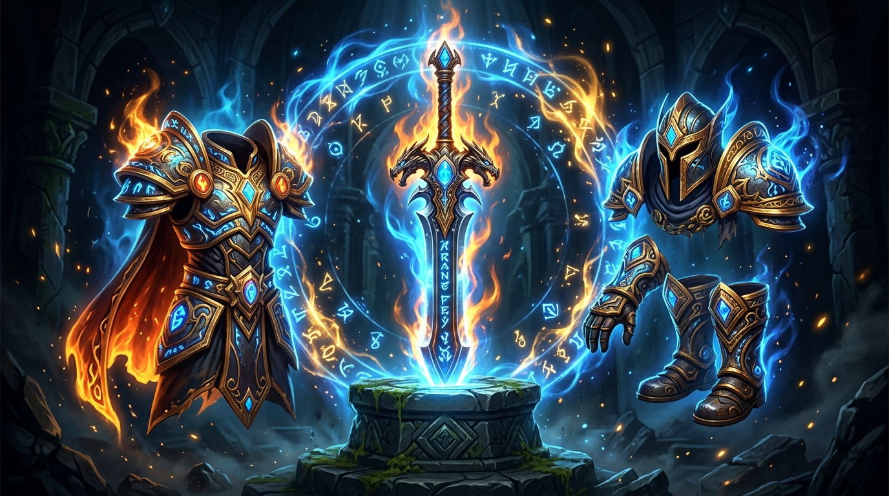

# Mod Item Level Scaling for AzerothCore (WotLK 3.3.5a)

<p align="center">
  
</p>

<p align="center">
  <a href="https://github.com/azerothcore/azerothcore-wotlk"></a>
  <a href="https://github.com/Ildourol/mod-item-level-scaling/blob/master/conf/mod_item_level_scaling.conf.dist"></a>
  <a href="https://github.com/Ildourol/mod-item-level-scaling/blob/master/acore-module.json"></a>
  
</p>

---

## Description

**mod-item-level-scaling** is a high-performance, **100% standalone** AzerothCore C++ module that dynamically scales equippable combat loot dropped inside instanced dungeons and raids to match real player progression.

Designed for level-scaling servers, solo-play, and dungeon-leveling experiences (including setups running `mod-autobalance` and `mod-playerbots`), it ensures that dungeon runs always reward level-appropriate equipment while strictly preserving Blizzard itemization balance, stat budgets, weapon speed curves, and boss loot prestige.

---

## Key Highlights

- **Zero Core Modifications (100% Standalone)**:
  Requires **no changes** to core AzerothCore files (`ObjectMgr.h`, `ObjectMgr.cpp`, etc.). Your core repository remains 100% stock upstream, ensuring completely conflict-free `git pull` updates from master or Playerbot branches.
- **Auto-Detected Compact ID Range (`SyntheticEntry.Start = "auto"`)**:
  Instead of allocating sparse ID ranges that inflate memory, the module dynamically detects the highest base item ID in your database and allocates synthetic variants in a compact range immediately above it (typically ~60,000+). This reduces `_itemTemplateStoreFast` vector memory overhead from 80+ MB down to **< 650 KB** (a >99% reduction).
- **64-Bit Bit-Packed Key & True $O(1)$ Hash Table**:
  Variant keys are packed into a 64-bit integer `(Base << 32) | (Level << 24) | (ItemLevel << 8) | Formula` and stored in `std::unordered_map<uint64, uint32>` with pre-allocated bucket `.reserve()`. Lookups execute in < 1 nanosecond with zero heap allocations, zero tree-traversal pointer overhead, and zero CPU cache misses during combat loot generation.
- **Zero Combat Stutter & Map Thread Lag**:
  Scalable variants are synchronized into `item_template` at server boot via the native `OnLoadCustomDatabaseTable()` hook. In-game loot generation is a pure, non-blocking in-memory read-only lookup with zero runtime SQL writes and zero map update tick delays.
- **Single-Query Startup Recovery (Zero N+1 Queries)**:
  Missing variants are synchronized in a single consolidated SQL `JOIN` query, eliminating thousands of sequential round-trip queries at boot.
- **Transactional Startup Pre-Staging**:
  Dungeon and raid equipment variants are generated across configured level brackets (`BracketStep`) and staged in batch transactions (500 ops per commit), completing first-time database population in milliseconds.

---

## Features

- **Real Player Authority**: Target scaling levels ($H$) are determined exclusively by the highest-level **real** player inside the instance. Playerbots never unintentionally inflate or skew item scaling targets.
- **Dynamic & Fixed Scaling Modes**:
  - **Dynamic Mode**: Retains authentic dungeon hierarchy ($Trash < Elite < Boss$) relative to $H$ using customizable level floors and ceilings.
  - **Fixed Mode**: Pinpoints the highest real player level $H$ directly.
- **Blizzard Data-Driven ItemLevel Model**: Calculates target `ItemLevel` from stock Blizzard equipment medians $M(\text{Level}, \text{Quality}, \text{SlotFamily})$, ensuring boss and raid tier gear remains superior without carrying endgame stat inflation into low-level brackets.
- **Native DBC Growth Curves**:
  - Leverages `RandomPropertiesPoints.dbc` point budget tables across all qualities (Uncommon, Rare, Epic) and all 5 inventory slot families to accurately rescale primary stats, ratings, armor, block value, and resistances.
  - Employs `ScalingStatValues.dbc` DPS curves for weapon damage while keeping weapon delay (speed) and damage spread intact.
- **Exhaustive Stat Scaling**:
  - Primary Stats: Strength, Agility, Stamina, Intellect, Spirit
  - Melee/Ranged Ratings: Attack Power, Ranged AP, Crit, Hit, Haste, Expertise, Armor Penetration
  - Spell Ratings: Spell Power, Spell Hit, Spell Crit, Spell Haste, Spell Penetration, MP5
  - Defensive Ratings: Defense, Dodge, Parry, Shield Block Rating, Shield Block Value, Health Regen
- **Persistent Synthetic Templates**:
  - Generates custom item templates and stores them in the `scaled_item_variant` table.
  - Items survive server restarts, logouts, mail, guild bank, auction house, and player trades.
  - Tooltip stats match equipped stats with 100% fidelity without client-side patch requirements.
- **Zero Global Mutation**:
  - Base `ItemTemplate` entries are never mutated. Vendor gear, quest rewards, world drops, and items owned by other players remain completely unaffected.
- **Broad Compatibility**:
  - Fully tested and compatible with `mod-playerbots` (rolling and auto-equip gear evaluation) and `mod-autobalance`.

---

## Architecture Overview

```mermaid
flowchart TD
    subgraph S1["1. Server Startup (World.cpp:380)"]
        A["worldserver initializes"] --> B["WorldScript::OnLoadCustomDatabaseTable()"]
        B --> C["ItemScalingRegistry: Auto-Detect Compact ID Range"]
        C --> D["SynchronizeExistingVariants() (Single Consolidated JOIN Query)"]
        D --> E["PreStageDungeonLoot() (Batch SQL Transaction)"]
        E --> F["Stock ObjectMgr::LoadItemTemplates() runs"]
        F --> G["AzerothCore natively populates _itemTemplateStoreFast"]
    end

    subgraph S2["2. In-Memory Index (Startup Hook)"]
        H["WorldScript::OnStartup()"] --> I["ItemScalingRegistry::Initialize()"]
        I --> J["64-bit Packed Keys: (Base << 32) | (Lvl << 24) | (Ilvl << 8) | Formula"]
        J --> K["std::unordered_map<uint64, uint32> (Pre-reserved O(1) Hash Map)"]
    end

    subgraph S3["3. Active Gameplay (Multi-Threaded Map Loops)"]
        L["Boss/Creature killed in instance"] --> M["ItemScalingLootScript::OnAfterLootTemplateProcess()"]
        M --> N["GetVariantEntry(packedKey) via std::shared_lock (< 1ns)"]
        N --> O["item.itemid = pre-staged variant ID"]
        O --> P["Player loots item -> Perfect tooltip, inspect, AH, mail, bots"]
    end
```



---

## Repository Structure

```
mod-item-level-scaling/
├── conf/
│   ├── conf.sh.dist                     # Module build and SQL registration script
│   └── mod_item_level_scaling.conf.dist # Complete module configuration file
├── docs/
│   ├── item_scaling_standalone_plan.md   # Zero core patch architectural plan
│   └── item_scaling_optimization_plan.md # SQL & memory throughput optimization plan
├── sql/
│   └── world/
│       └── base/
│           └── scaled_item_variant.sql  # Database table for persistent item variants
├── src/
│   ├── ItemScalingBaseline.cpp          # Stock median ItemLevel baseline lookup
│   ├── ItemScalingBaseline.h
│   ├── ItemScalingCommon.h              # Common definitions and data models
│   ├── ItemScalingConfig.cpp            # Configuration parser and cache
│   ├── ItemScalingConfig.h
│   ├── ItemScalingFormula.cpp           # DBC-driven stat and weapon scaling logic
│   ├── ItemScalingFormula.h
│   ├── ItemScalingLootScript.cpp        # Zero-stutter loot hook
│   ├── ItemScalingLootScript.h
│   ├── ItemScalingRegistry.cpp          # Startup DB sync, pre-staging & fast lookup
│   ├── ItemScalingRegistry.h
│   ├── ItemScalingWorldScript.cpp       # World lifecycle hooks and startup loader
│   ├── ItemScalingWorldScript.h
│   └── ItemScaling_loader.cpp           # Script registry entry point
├── assets/                              # Documentation media
├── acore-module.json                    # Module metadata
└── include.sh                           # Bash build integration
```

---

## Installation

1. Navigate to your AzerothCore modules folder and clone this repository:
   ```bash
   cd azerothcore-wotlk/modules
   git clone https://github.com/Ildourol/mod-item-level-scaling.git
   ```

2. Re-generate CMake and compile the project (no core source edits needed):
   ```bash
   cd azerothcore-wotlk/build
   cmake ../ -DCMAKE_INSTALL_PREFIX=/path/to/server
   cmake --build . --config RelWithDebInfo --target worldserver -j $(nproc)
   ```

3. Configure the module:
   ```bash
   cp ../modules/mod-item-level-scaling/conf/mod_item_level_scaling.conf.dist /path/to/server/etc/mod_item_level_scaling.conf
   ```

4. Database Setup:
   - The module automatically verifies and creates `scaled_item_variant` table if it doesn't already exist.
   - If using `db_assembler.sh`, the SQL file in `sql/world/base/` will be imported automatically.

---

## Configuration

Detailed configuration options are documented in `conf/mod_item_level_scaling.conf.dist`. Key settings include:

| Setting | Default | Description |
| :--- | :---: | :--- |
| `ItemScaling.Enable` | `1` | Enable or disable the module entirely |
| `ItemScaling.ScaleDungeons` | `1` | Enable scaling in normal 5-player instances |
| `ItemScaling.ScaleRaids` | `1` | Enable scaling in 10/25-player raids |
| `ItemScaling.ScaleHeroics` | `1` | Enable scaling in heroic dungeons/raids |
| `ItemScaling.ScaleChests` | `1` | Enable scaling for instanced chests and gameobjects |
| `ItemScaling.LevelScaling.Method` | `"dynamic"` | Scaling mode: `"dynamic"` or `"fixed"` |
| `ItemScaling.ExcludedLevels` | `"60, 70, 80"` | Milestone levels excluded from scaling to preserve stock endgame loot |
| `ItemScaling.SyntheticEntry.Start` | `"auto"` | Starting ID for synthetic templates (`"auto"` allocates immediately above max DB entry) |
| `ItemScaling.SyntheticEntry.AutoOffset` | `1000` | Safety buffer between highest DB item and synthetic items when `Start = "auto"` |
| `ItemScaling.PreStageDungeonLoot` | `1` | Pre-generate and sync instance loot into `item_template` at boot for zero runtime DB lag |
| `ItemScaling.BracketStep` | `2` | Level interval between pre-staged scaling tiers (1-10) |
| `ItemScaling.RequiredLevel.Policy` | `"target-capped-player"` | Required level assignment policy (`"target-capped-player"`, `"player"`, `"target"`) |
| `ItemScaling.PreserveNonZeroStats` | `1` | Prevent small non-zero stats from rounding down to 0 at lower levels |
| `ItemScaling.RealPlayersOnly` | `1` | Only real players determine the scaling target level (bots strictly excluded) |

---

## Compatibility and Requirements

- **AzerothCore WotLK (branch `master` or `Playerbot`)** (latest commits)
- **Core Modifications**: **None** (100% standalone)
- **Client**: World of Warcraft: Wrath of the Lich King (3.3.5a - Build 12340)
- Compatible with:
  - [mod-autobalance](https://github.com/azerothcore/mod-autobalance)
  - [mod-playerbots](https://github.com/liyunfan1223/mod-playerbots)

---

## License

This module is released under the GNU General Public License v2 (or at your option any later version) in accordance with AzerothCore licensing.
