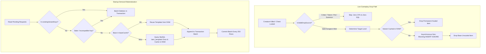

# Item Level Scaling for AzerothCore


Scale eligible dungeon and raid equipment dynamically or to fixed target levels matching the player/party level in AzerothCore 3.3.5a.

This module uses a **Demand Ledger Architecture** with permanent, static item templates. It requires **no AzerothCore core patch, no Playerbots patch, no client patch, no custom client Item.dbc, and no runtime item template publication**.

---

## Features

- **Dynamic & Fixed Level Scaling**: Scales equipment dropped in dungeons and raids to match the player or party level.
- **Demand-Ledger Architecture**: Scaled item templates are requested on-demand during live gameplay via non-blocking asynchronous MySQL operations and materialized into permanent `item_template` records upon the next server startup.
- **Dual-Approach Random Suffix Handling**:
  - **Mode 0 (Default - Skip)**: Items with random properties/suffixes (e.g. *"... of the Bear"*) drop as their original base version, completely avoiding the standard 3.3.5a client tooltip `+0` stat bug without client patches. Fixed-stat greens and all rare/epic gear scale normally.
  - **Mode 1 (Server-Side Stat Baking)**: Scales random suffix gear to the dungeon's level bracket, calculates stat points directly from `RandPropPoints.dbc`, and bakes the stats and suffix into `item_template` as fixed stats (`RandomSuffix = 0, RandomProperty = 0`). Gives full scaled stats in bag tooltips and chat links with zero client edits.
- **High Performance & Zero Startup Lag**:
  - **In-Memory Baseline Generation**: Calculates item baselines directly from `sObjectMgr->GetItemTemplateStore()` in RAM, eliminating the startup table scan of `item_template`.
  - **Junk Creature Filtering**: Skips critters, totems, pets, and temporary summons before triggering scaling logic or enqueuing demand.
  - **Startup Base Template Cache**: Caches base templates in RAM during demand materialization, querying MySQL once per base item across all level brackets.
  - **Bulk Deduplication & Batched Deletions**: Deletes redundant and stale demand in transactions batched at 250 rows.
  - **Live Configuration Reload**: Operational settings (`Enable`, `BracketStep`, `ScaleDungeons`, `ScaleRaids`, etc.) can be modified live via `.reload config` without restarting the server.
- **Playerbots & Economy Safe**: Fully compatible with `mod-playerbots`, autogear, AH, guild banks, and mail. Permanent item IDs ensure item validity across restarts.

---

## Architecture Overview


```mermaid
flowchart TD
    subgraph Live Gameplay Drop Path
        K[Creature Killed / Chest Looted] --> S{IsValidDropSource?}
        S -- Critter / Totem / Pet / Summon --> X[Skip: Zero CPU & Zero SQL]
        S -- Valid Dungeon Mob --> P[Determine Target Level]
        P --> V{Variant Cached in RAM?}
        V -- Yes --> R[Drop Permanent Scaled Item]
        V -- No --> Q[Asynchronous Non-Blocking INSERT IGNORE]
        Q --> B[Drop Base Unscaled Item]
    end

    subgraph Startup Demand Materialization
        M[Read Pending Requests] --> S1{In existingVariantKeys?}
        S1 -- Yes --> B1[Batch Deletion in Transaction]
        S1 -- No --> S2{Stale / Incompatible Key?}
        S2 -- Yes --> B1
        S2 -- No --> BC{Base in baseCache?}
        BC -- Hit --> U[Reuse Template from RAM]
        BC -- Miss --> DB[Query MySQL item_template Once & Cache in RAM]
        U --> T[Append to Transaction Batch]
        DB --> T
        T --> C[Commit Batch Every 250 Rows]
    end
```

---

## Installation

1. Clone the repository into your AzerothCore `modules/` directory:
   ```bash
   cd /path/to/azerothcore/modules
   git clone https://github.com/Ildourol/mod-item-level-scaling.git
   ```

2. Re-run CMake and compile your `worldserver`.

3. Copy the configuration file to your worldserver configuration directory:
   ```bash
   cp modules/mod-item-level-scaling/conf/mod_item_level_scaling.conf.dist /path/to/server/etc/mod_item_level_scaling.conf
   ```

4. Database tables will automatically be created by AzerothCore's `DBUpdater` using:
   - `data/sql/db-world/base/scaled_item_variant.sql`
   - `data/sql/db-world/updates/2026_09_27_00_item_scaling_initial_schema.sql`

---

## Configuration

Settings are documented in [`conf/mod_item_level_scaling.conf.dist`](conf/mod_item_level_scaling.conf.dist):

```ini
# Enable or disable the module
ItemScaling.Enable = 1

# Scaling method: "dynamic" (scales to highest real player) or "fixed" (scales to MaxLevel)
ItemScaling.Method = "dynamic"

# Demand Ledger: Record requests and materialize permanent item templates
ItemScaling.DemandLedger.Enable = 1

# Handling of Random Suffix / Property gear (e.g. "... of the Bear")
# 0 - (Default) Skip scaling for random suffix gear to ensure 100% native client tooltips
# 1 - Stat Baking: Scale and bake stats directly into item_template (bypasses client Item.dbc)
ItemScaling.RandomSuffix.Mode = 0

# Instance types to scale
ItemScaling.ScaleDungeons = 1
ItemScaling.ScaleRaids = 0
ItemScaling.ScaleHeroics = 0

# Directional scaling
ItemScaling.ScaleUp = 1
ItemScaling.ScaleDown = 1

# Level bracketing (1 = exact level, 5 = bracket every 5 levels)
ItemScaling.BracketStep = 1

# Rarity filters
ItemScaling.ScalePoor = 1
ItemScaling.ScaleCommon = 1
ItemScaling.ScaleUncommon = 1
ItemScaling.ScaleRare = 1
ItemScaling.ScaleEpic = 1
ItemScaling.ScaleLegendary = 1
ItemScaling.ScaleArtifact = 1
ItemScaling.ScaleHeirloom = 0
```

---

## Complete Persisted State

The module maintains three InnoDB tables:
- **`scaled_item_variant`**: Permanent synthetic item mappings. Contains the unique 7-field key (`base_entry`, `target_effective_level`, `target_item_level`, `formula_version`, `generator_revision`, `required_level`, `random_property_id`), 7 non-null validated base-identity fields (`class`, `subclass`, `sound_override_subclass`, `material`, `displayid`, `inventory_type`, `sheath`), and `preserve_nonzero_stats`.
- **`scaled_item_variant_request`**: Demand ledger capturing gameplay requests asynchronously with the composite 7-field primary key.
- **`item_template`**: Real scaled stats, damage, armor, block, resistances, and levels cloned from the base item with scaled numerical values.

---

## Loot Safety and Playerbots Compatibility

- **Quest & Unique Protection**: Quest-required items, items with `MaxCount != 0`, unique-equipped items, quest starters, scripted equipment, and disabled entries are never altered.
- **Playerbots Integration**: Playerbots reads ordinary static `ItemTemplate` stats, levels, damage, armor, and inherited metadata. `StatsCollector`, `StatsWeightCalculator`, `ItemUsageValue`, `LootRollAction`, and `EquipAction` interact with scaled items natively without special casing or hooks.

---

## License

GNU General Public License v2 or later, consistent with AzerothCore.
