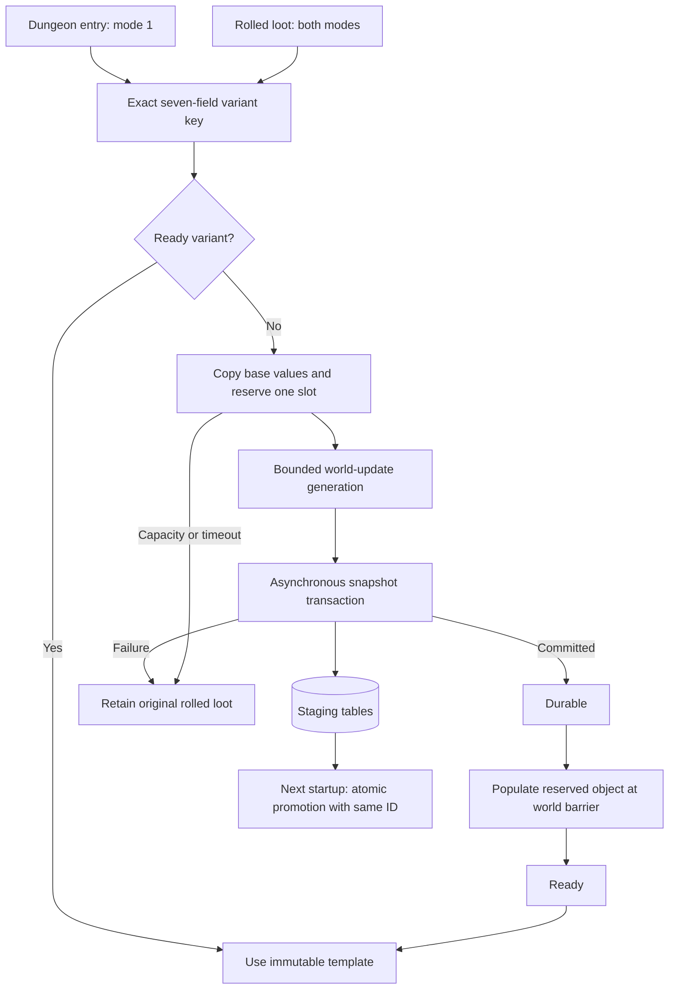

# Item scaling architecture

The accepted [first-run hybrid plan](plans/first_run_item_scaling_hybrid_plan.md) is implemented entirely in the module. Source inspection targets the local AzerothCore Playerbot fork; another core must provide the same hooks, mutable template pointees and world/map update ordering.

## Startup lifecycle

`OnLoadCustomDatabaseTable` executes before ObjectMgr loads items. The registry creates and validates its schema, recovers live snapshots, handles existing legacy demand, then tops up inert reserved rows. Startup SQL may block here because players cannot log in yet.

Recovery verifies InnoDB, matching snapshot column order/types/nullability, and one complete staged item/mapping/assigned reservation per ID. A single transaction replaces owned placeholders, inserts permanent mappings and removes the completed staging records and reservations. It preserves saved values even if base stats or configuration have changed. Corrupt recovery stops startup. Old issued generator families are retained unchanged.

After core stores are loaded, `OnBeforeWorldInitialized` validates permanent variants, excludes permanent and reserved entries from the baseline, validates every reserved pointer, and loads the read-only dungeon loot catalogue. The catalogue traverses reference graphs with a visited set, includes creature difficulty variants and chests, and skips quest-only rows. It prepares no scaled templates during startup.

## Runtime lifecycle

`ItemScalingLive` owns a mutex-protected key registry, free slots, value snapshots and GUID-based deferred actions. Exact keys deduplicate concurrent map-worker and prewarm requests. Queued, in-flight and durable work count toward `MaxPendingVariants`; available reserved slots also bound total retained request state. Failed slots remain unavailable for the rest of the process and can be reclaimed next startup if no snapshot was committed.

Each update polls transaction callbacks without waiting, generates at most `MaxPublishPerTick` variants, publishes at most that number, and performs bounded catalogue preparation. Mode 1 refreshes on the highest eligible player level or config revision. Mode 2 does not scan the catalogue during gameplay. The actual rolled-drop path catches missing keys in either mode.

## Publication and thread ownership

The local core exposes `std::vector<ItemTemplate*> const*` through `GetItemTemplateStoreFast()`. Its container is const; each pointed-to object is mutable. Reserved objects already belong to both native lookup containers. Publication copies a full template into one unused object; it does not resize containers, replace pointers, insert a runtime core entry, mutate a base template or rewrite an issued variant.

The local `World::Update` calls `MapMgr::Update`, which joins map workers, before `OnWorldUpdate`. Native item queries run through world/map session updates. Template publication and deferred loot replacement run after those phases. Engine objects are freshly resolved by map/instance/GUID; raw Player/Creature/GameObject pointers do not survive a tick or enter database callbacks. Shared request and packet bookkeeping uses the module mutex. Transaction callbacks only change module state, and are polled on the world thread.

These source contracts are audited by `tests/check_source.py`. Compilation and a runtime check with several map workers remain required before release.

## Deferred loot and queries

`OnAfterLootTemplateProcess` uses the existing target, bracket, baseline and required-level rules. Ready variants replace the original entry in its existing LootItem. Pending requests retain index, entry, count, rolled property and suffix fingerprints. Fresh FillLoot invalidates previous tracking; removal hooks cancel destroyed sources. Replacement requires an intact fingerprint and `LOOT_NONE`, so an active roll is never rewritten.

The const `ServerScript::CanPacketReceive` overload gates `CMSG_LOOT` before native creature group rolls. On completion, the same request is requeued for the next normal session phase. The chest adapter intercepts ordinary gameobjects only after native OPEN_LOCK has succeeded, generates loot once, and postpones group-roll initialization and activation. Resumption validates current objects, map, ownership and range. It keeps prepared contents when an opener leaves and waits for an eligible opener; despawn cancels the source. Custom script/AI chests are outside this adapter.

Original loot is released on timeout or failure. An uncommitted synthetic item is never awarded. SQL callbacks may complete later and make the variant usable for subsequent drops without altering an already released item.

Pending template queries are held by player GUID and entry. Reserved query responses are suppressed to prevent caching placeholder metadata. Once ready, the native query is requeued. Native query fields are serialized in the snapshot, and stat arrays are compacted to match ObjectMgr's loader. This aligns server stats and client metadata; client rendering remains a live acceptance check.

## Persistence and random bonuses

The live transaction saves the full normalized template, exact mapping, identity snapshot and slot assignment. It uses numeric SQL and UTF-8 hex text literals, avoiding synchronous SQL escaping or database checkout from gameplay. Snapshot tables are copies of the canonical item/mapping schema. Issued entries are immutable.

Random mode defaults to skip. Opt-in baking accepts only representable stat and resistance enchantments, validates DBC entries and integer bounds, and clears random metadata only after successful baking. Startup validation explicitly accepts cleared random fields for baked keys. Generator revision 2 separates the checked formula from earlier issued templates.

Playerbots reads live templates for loot and gear evaluation. Its startup autogear catalogue is deliberately left alone and discovers promoted entries after the next restart.
