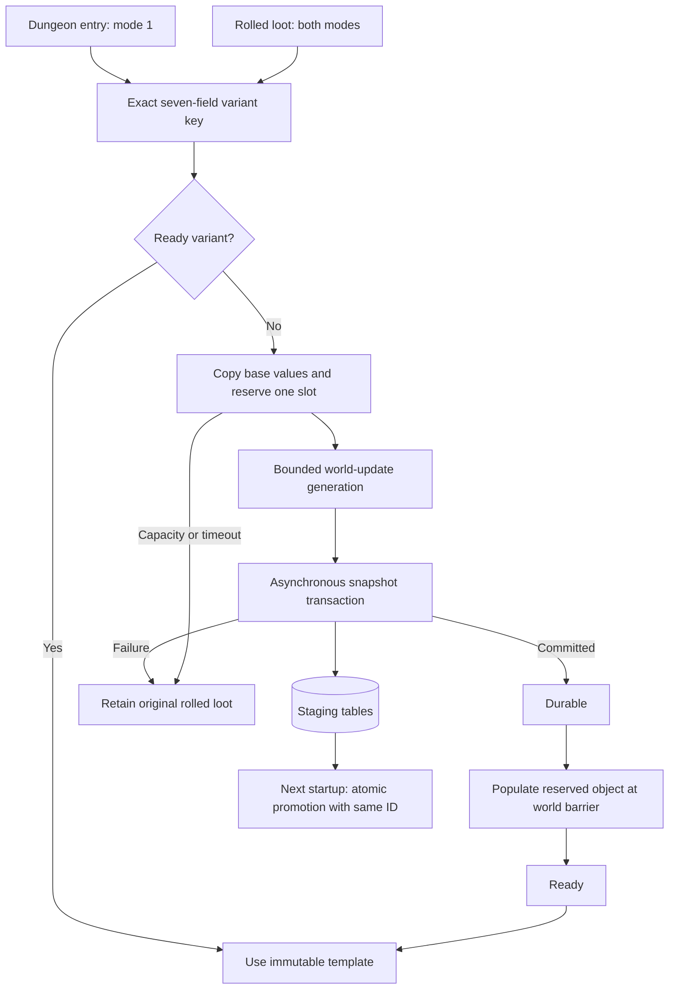
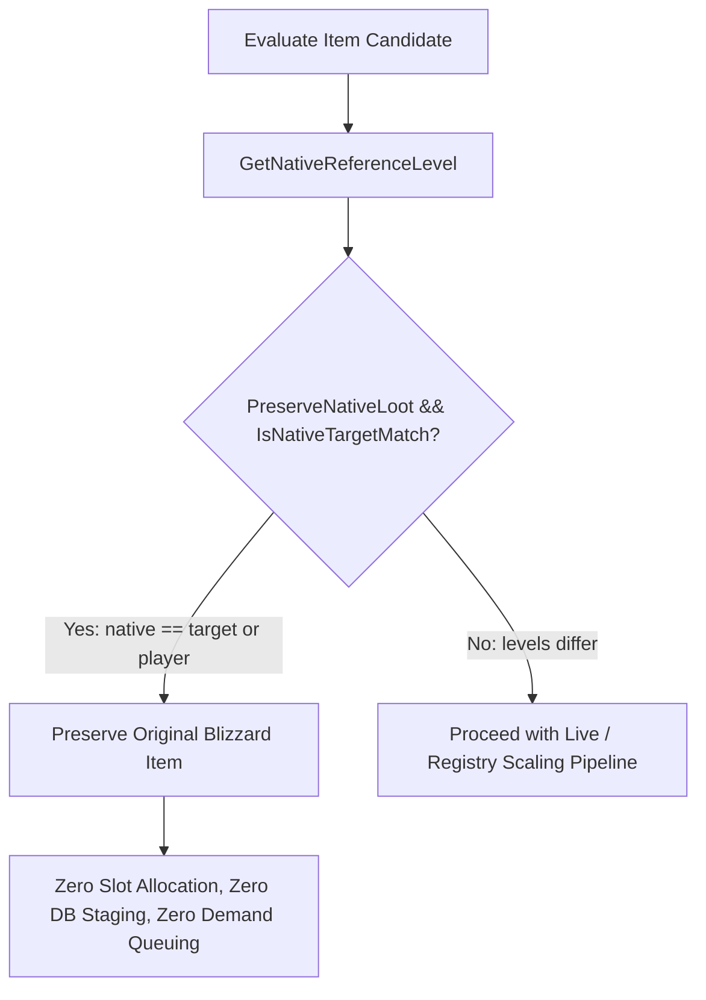

# Item scaling architecture

The accepted [first-run hybrid plan](plans/first_run_item_scaling_hybrid_plan.md) is implemented entirely in the module. Source inspection targets the local AzerothCore Playerbot fork; another core must provide the same hooks, mutable template pointees and world/map update ordering.

## Startup lifecycle

`OnLoadCustomDatabaseTable` executes before ObjectMgr loads items. The registry creates and validates its schema, recovers live snapshots, validates persistent invariants, then tops up inert reserved rows. Startup SQL may block here because players cannot log in yet.

Recovery verifies InnoDB, matching snapshot column order/types/nullability, and one complete staged item/mapping/assigned reservation per ID. A single transaction replaces owned placeholders, inserts permanent mappings and removes the completed staging records and reservations. It preserves saved values even if base stats or configuration have changed. Corrupt recovery stops startup. Old issued generator families are retained unchanged.

After core stores are loaded, `OnBeforeWorldInitialized` validates permanent variants, excludes permanent and reserved entries from the baseline, validates every reserved pointer, and loads the read-only dungeon loot catalogue. The catalogue traverses reference graphs with a visited set, includes creature difficulty variants and chests, and skips quest-only rows. It prepares no scaled templates during startup.

## Runtime lifecycle

`ItemScalingLive` owns a mutex-protected key registry, free slots, value snapshots and GUID-based deferred actions. Exact keys deduplicate concurrent map-worker and prewarm requests. Queued, in-flight and durable work count toward `MaxPendingVariants`; available reserved slots also bound total retained request state. Failed slots remain unavailable for the rest of the process and can be reclaimed next startup if no snapshot was committed.

Each update polls transaction callbacks without waiting, generates at most `MaxPublishPerTick` variants, publishes at most that number, and performs bounded catalogue preparation. Mode 1 refreshes on the highest eligible player level or config revision. Mode 2 does not scan the catalogue during gameplay. The actual rolled-drop path catches missing keys in either mode.

## Publication and thread ownership

The local core exposes `std::vector<ItemTemplate*> const*` through `GetItemTemplateStoreFast()`. Its container is const; each pointed-to object is mutable. Reserved objects already belong to both native lookup containers. Publication copies a full template into one unused object; it does not resize containers, replace pointers, insert a runtime core entry, mutate a base template or rewrite an issued variant.

The local `World::Update` calls `MapMgr::Update`, which joins map workers, before `OnWorldUpdate`. Native item queries run through world/map session updates. Template publication and deferred loot replacement run after those phases. Engine objects are freshly resolved by map/instance/GUID; raw Player/Creature/GameObject pointers do not survive a tick or enter database callbacks. Shared request and packet bookkeeping uses the module mutex. Transaction callbacks only change module state, and are polled on the world thread.

These source contracts are audited by `tests/check_source.py`. Compilation and a runtime check with several map workers remain required before release.

## Deferred loot and queries

`OnAfterLootTemplateProcess` uses the existing target, bracket, baseline and required-level rules. Ready variants replace the original entry in its existing LootItem. Pending requests retain index, entry, count, rolled property and suffix fingerprints. Fresh FillLoot invalidates previous tracking; removal hooks cancel destroyed sources. Replacement requires an intact fingerprint and `LOOT_NONE`, so an active roll is never rewritten.

The const `ServerScript::CanPacketReceive` overload gates `CMSG_LOOT` before native creature group rolls. On completion, the same request is requeued for the next normal session phase. The chest adapter intercepts ordinary gameobjects only after native OPEN_LOCK has succeeded, generates loot once, and postpones group-roll initialization and activation. Resumption validates current objects, map, ownership and range. It keeps prepared contents when an opener leaves and waits for an eligible opener; despawn cancels the source. Custom script/AI chests are outside this adapter.

Original loot is released on timeout or failure. An uncommitted synthetic item is never awarded. SQL callbacks may complete later and make the variant usable for subsequent drops without altering an already released item.

Pending template queries are held by player GUID and entry. Reserved query responses are suppressed to prevent caching placeholder metadata. Once ready, the native query is requeued. Native query fields are serialized in the snapshot, and stat arrays are compacted to match ObjectMgr's loader. This aligns server stats and client metadata; client rendering remains a live acceptance check.

## Persistence and random bonuses

The live transaction saves the full normalized template, exact mapping, identity snapshot and slot assignment. It uses numeric SQL and UTF-8 hex text literals, avoiding synchronous SQL escaping or database checkout from gameplay. Snapshot tables are copies of the canonical item/mapping schema. Issued entries are immutable.

Random mode defaults to skip. Opt-in baking accepts only representable stat and resistance enchantments, validates DBC entries and integer bounds, and clears random metadata only after successful baking. Startup validation explicitly accepts cleared random fields for baked keys. Generator revision 2 separates the checked formula from earlier issued templates.

Playerbots reads live templates for loot and gear evaluation. Its startup autogear catalogue is deliberately left alone and discovers promoted entries after the next restart.

## Native Reference Match Bypass & Loot Preservation

When `ItemScaling.PreserveNativeLoot = 1` (the default), the module dynamically identifies items whose native reference level matches the scaling target or player level, dropping the original Blizzard item directly and avoiding unnecessary synthetic variant allocation.

1. **Native Reference Calculation**:
   - Uses `RequiredLevel` when non-zero (`requiredLevel > 0 ? requiredLevel : std::clamp(itemLevel, 1, 80)`).
2. **Authoritative Matching**:
   - `IsNativeTargetMatch(nativeRef, requestedTarget, bracketedTarget, playerLevel)` evaluates whether `nativeRef` matches `requestedTarget`, `bracketedTarget`, or `playerLevel` (supporting lower-level instances and diverse boss dungeons such as Blackrock Depths).
3. **Mode 1 Prewarm Optimization**:
   - Prior to allocating `Loot preview` structs or invoking `PrepareLoot`, catalogue prewarm resolves the source's target levels using `ItemScalingLootScript::ResolveTargetLevels`. Items matching native reference levels are skipped immediately, conserving per-tick prewarm budget and preventing phantom variant generation.
4. **Mode 2 & Non-Live / Offline Mode**:
   - Rolled items matching native reference levels return immediately from `scaleLootItem`, dropping original Blizzard items natively.
   - `ItemScalingRegistry::FindOrRequestVariant` enforces a defense-in-depth bypass, guaranteeing that when `ItemScaling.Live.Enable = 0`, no new variants are generated and original Blizzard items drop natively.
5. **Replacement of `ExcludedLevels`**:
   - Replaces the legacy manual `ItemScaling.ExcludedLevels` blacklist with dynamic, intrinsic native-match preservation.

## Dynamic Scaling Based on In-Instance Mob Level

In dynamic scaling mode, loot targets are calculated directly from the creature's in-instance effective level ($L_{\text{mob}}$) rather than unscaled database templates:

$$\text{RawTarget} = L_{\text{mob}} - \text{Floor}$$
$$\text{Target} = \text{clamp}\Big(\text{RawTarget},\ \text{MinLevel},\ \min(\text{PlayerLevel} + \text{Ceiling},\ \text{MaxLevel})\Big)$$

1. **Default Dynamic Floor = 3**:
   - The global default for all `ItemScaling.Dynamic.Floor.*` settings is `3` (Ceiling = `0`).
   - All raid skull bosses ($L_{\text{mob}} = 80 + 3 = 83$ at player level 80) drop max level 80 items by default ($83 - 3 = 80$).
   - All raid trash mobs ($L_{\text{mob}} = 80$) drop level 77 items by default ($80 - 3 = 77$).
   - 5-man dungeon bosses ($L_{\text{mob}} = 80 + 2 = 82$) drop level 79 items by default ($82 - 3 = 79$).
2. **Authoritative Parity Between Prewarm & Live Combat**:
   - **Live Combat**: `ResolveEffectiveCreatureLevel` reads the live scaled level `creature->GetLevel()`.
   - **Mode 1 Prewarm**: Calculates the identical $L_{\text{mob}}$ via boss template rank and map type (+3 for raid skull boss, +2 for dungeon boss), guaranteeing 100% target level parity.
3. **Native Content Integration**:
   - A level 70 player running Tempest Keep ($L_{\text{mob}} = 73$) with default `Floor = 3` produces $\text{Target} = 70$.
   - Because the native drop is level 70, the Native Reference Match Bypass automatically triggers, dropping original Blizzard items without generating synthetic variants.

## Dynamic Floor & Ceiling Variance (Randomized Level Shifts)

To introduce controlled randomness and excitement to dungeon and raid progression (e.g. Warforged / lucky boss drops), the module supports configurable linear percentage variance for shifts of $\pm 1, \pm 2, \pm 3$ levels on dynamic floor and ceiling calculations.

### Mechanics & Delta Mapping
- **Floor Variance ($d_F \in \{-3, -2, -1, 0, +1, +2, +3\}$)**:
  - $F_{\text{eff}} = \max(0, F_{\text{base}} + d_F)$
  - Target formula subtracts floor: $\text{RawTarget} = L_{\text{mob}} - F_{\text{eff}}$.
  - **Negative delta ($d_F < 0$) = UPGRADE**: Reduces the floor, raising the item drop level:
    - $-1$ shift: Floor becomes $2 \implies$ level 82 dungeon boss drops level 80 loot ($82 - 2 = 80$).
    - $-2$ shift: Floor becomes $1 \implies$ level 80 dungeon trash drops level 79 loot ($80 - 1 = 79$).
    - $-3$ shift: Floor becomes $0 \implies$ Jackpot! Level 80 dungeon/raid trash drops max level 80 loot ($80 - 0 = 80$).
- **Ceiling Variance ($d_C \in \{-3, -2, -1, 0, +1, +2, +3\}$)**:
  - $C_{\text{eff}} = \max(0, C_{\text{base}} + d_C)$
  - Ceiling cap: $\min(P_{\text{player}} + C_{\text{eff}}, \text{MaxLevel})$.
  - Positive delta ($d_C > 0$) raises the ceiling above player level. (Disabled by default, base ceiling remains 0).

### Defaults & Distribution
- `ItemScaling.Dynamic.Floor.Variance.Enable = 1` (Enabled by default)
- `ItemScaling.Dynamic.Ceiling.Variance.Enable = 0` (Disabled by default)
- Default Floor Variance across categories: `"-1:20.0, -2:10.0, -3:5.0"` (35% total shift chance; 65% base Floor 3 drop).
- `ItemScaling.Dynamic.Variance.Scope`:
  - `0` (Default): Per-Loot / Per-Boss (the entire creature corpse shares the rolled floor/ceiling).
  - `1`: Per-Item (each scalable item on the corpse rolls independently).
- **Prewarm Invariant**: Mode 1 prewarm strictly uses delta 0 to ensure deterministic canonical baseline templates in memory; live on-demand engine publishes lucky rolled variants seamlessly.

