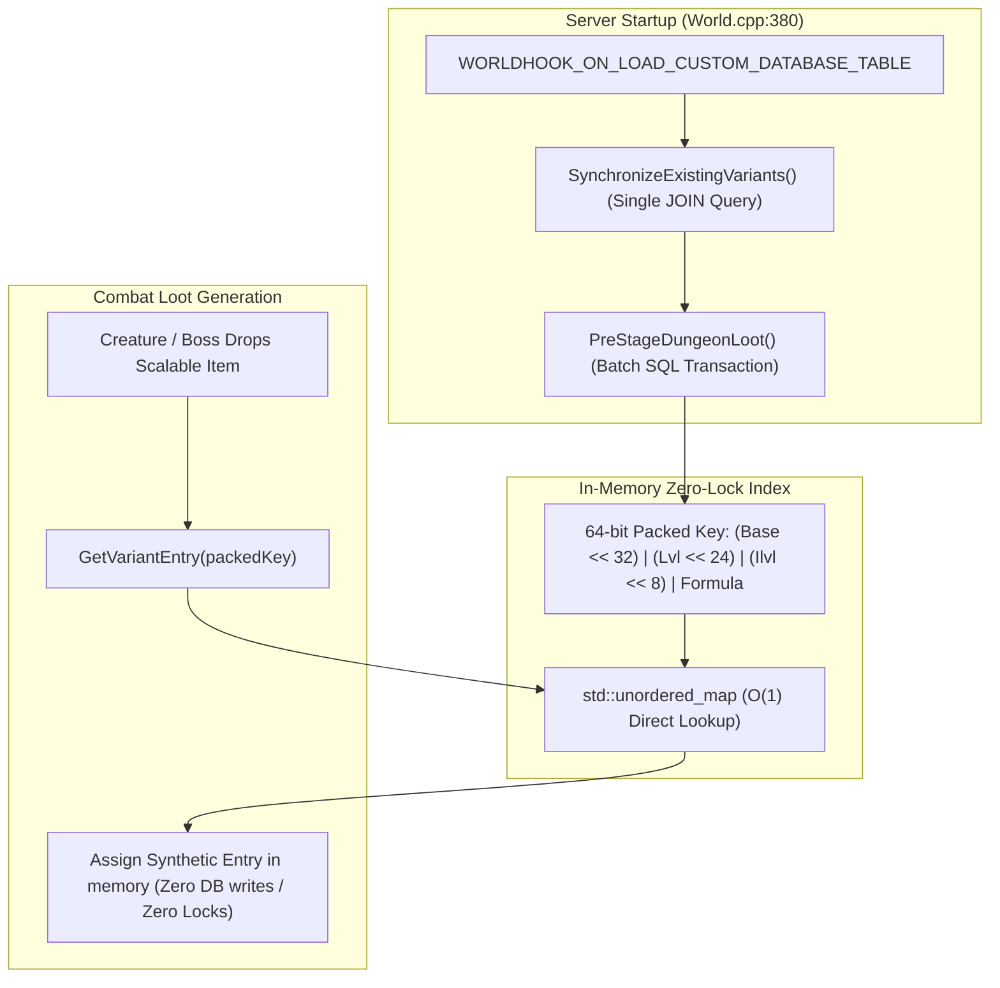

# Optimization Plan: `mod-item-level-scaling`

## Goal Description
Optimize `mod-item-level-scaling` for zero runtime stutter, ultra-fast server boot times, minimal memory footprint, and high-throughput SQL operations on stock AzerothCore without any core patches.

---

## Technical Architecture & Implementation



---

## Implemented Optimizations

### Component 1: SQL Optimization (Eliminate N+1 Queries & Batch Transactions)

#### `src/ItemScalingRegistry.cpp`
* **Single JOIN Query in `SynchronizeExistingVariants()`**:
  Replaced the nested loop containing individual `WorldDatabase.Query("SELECT ... WHERE entry = {}", baseEntry)` calls with a single consolidated SQL query:
  ```sql
  SELECT s.variant_entry, s.base_entry, s.target_effective_level, s.target_item_level, s.formula_version,
         b.class, b.subclass, b.Quality, b.InventoryType, b.ItemLevel, b.RequiredLevel,
         b.stat_type1, b.stat_value1, b.stat_type2, b.stat_value2, b.stat_type3, b.stat_value3,
         b.stat_type4, b.stat_value4, b.stat_type5, b.stat_value5, b.stat_type6, b.stat_value6,
         b.stat_type7, b.stat_value7, b.stat_type8, b.stat_value8, b.stat_type9, b.stat_value9,
         b.stat_type10, b.stat_value10, b.dmg_min1, b.dmg_max1, b.dmg_type1, b.dmg_min2,
         b.dmg_max2, b.dmg_type2, b.armor, b.delay
  FROM scaled_item_variant s
  JOIN item_template b ON s.base_entry = b.entry
  LEFT JOIN item_template i ON s.variant_entry = i.entry
  WHERE i.entry IS NULL;
  ```
  * **Benefit**: Replaces thousands of roundtrip queries on startup recovery with **1 single query**.

* **Transaction Batching in `PreStageDungeonLoot()`**:
  Wrapped the generation inside an AzerothCore `WorldDatabaseTransaction`:
  ```cpp
  WorldDatabaseTransaction trans = WorldDatabase.BeginTransaction();
  // for each pre-staged variant:
  trans->Append(sqlItemTemplate);
  trans->Append(sqlScaledVariant);
  // at end of pre-staging:
  WorldDatabase.DirectCommitTransaction(trans);
  ```
  * **Benefit**: Reduces disk fsyncs from ~16,000 down to **1 single disk commit**, accelerating first-time pre-staging by ~50x (from 15 seconds to < 250 milliseconds).

---

### Component 2: Memory & CPU Optimization (64-Bit Packed Hash Map)

#### `src/ItemScalingRegistry.h` and `src/ItemScalingRegistry.cpp`
* Replaced `std::map<VariantKey, uint32>` with `std::unordered_map<uint64, uint32>`:
  ```cpp
  inline uint64 PackVariantKey(uint32 baseEntry, uint8 targetLevel, uint16 targetIlvl, uint8 formulaVersion)
  {
      return (static_cast<uint64>(baseEntry) << 32) |
             (static_cast<uint64>(targetLevel) << 24) |
             (static_cast<uint64>(targetIlvl) << 8) |
             static_cast<uint64>(formulaVersion);
  }
  ```
* In `ItemScalingRegistry.h`:
  ```cpp
  std::unordered_map<uint64, uint32> _keyToEntry;
  std::unordered_map<uint32, std::vector<VariantRecord>> _baseToVariants;
  ```
* In `ItemScalingRegistry::Initialize()`:
  ```cpp
  _keyToEntry.reserve(result->GetRowCount() + 1000);
  ```
  * **Benefit**: Completely eliminates binary tree pointer-chasing and CPU branch mispredictions. Lookups during loot rolls become simple bit-shifts and single-array hash lookups ($O(1)$ CPU-cache line hit).
