# Implementation Plan: Standalone `mod-item-level-scaling` (Zero Core Patch)

## Goal Description
Redesign `mod-item-level-scaling` to operate as a 100% standalone AzerothCore module without requiring any modifications to AzerothCore core files (`ObjectMgr.h`, `ObjectMgr.cpp`, etc.). The redesigned module will eliminate `sObjectMgr->AddCustomItemTemplate()`, reduce memory overhead by over 99% through compact auto-detected ID ranges, and eliminate runtime combat stuttering by utilizing native database startup synchronization and zero-lock runtime lookups.

---

## User Review Required

> [!IMPORTANT]
> **Zero Core Modifications**: Once this plan is implemented, your AzerothCore core repository ([`azerothcore-wotlk`](file:///C:/Users/Admin/AntigravityProfiles/Projects%20Azerothcore/Azerothcore%20modules/azerothcore-wotlk)) can have the changes in [`ObjectMgr.h`](file:///C:/Users/Admin/AntigravityProfiles/Projects%20Azerothcore/Azerothcore%20modules/azerothcore-wotlk/src/server/game/Globals/ObjectMgr.h) and [`ObjectMgr.cpp`](file:///C:/Users/Admin/AntigravityProfiles/Projects%20Azerothcore/Azerothcore%20modules/azerothcore-wotlk/src/server/game/Globals/ObjectMgr.cpp) reverted back to 100% pristine stock upstream. `git pull` from AzerothCore master or Playerbots will never conflict with this module again.

> [!NOTE]
> **Auto-Detected Entry Range (`SyntheticEntry.Start = "auto"`)**:
> Instead of hardcoding `10000000` (which forced AzerothCore to allocate an 80+ MB sparse vector), the module will automatically detect the highest item ID in your database (typically ~55,000 for WotLK, or ~60,000 with custom items) and allocate synthetic variants immediately above it (e.g. starting at `60000` or `70000`). This shrinks `_itemTemplateStoreFast` memory consumption down to **< 650 KB** (a 99.2% memory savings).

> [!TIP]
> **Zero In-Game Stuttering**:
> In the current implementation, every time a boss is killed and loot is rolled, the server executes a synchronous SQL write (`INSERT IGNORE INTO scaled_item_variant`) and locks two mutexes in the map update thread. Under the new architecture, scalable variants are synchronized at server boot into `item_template` via the native `OnLoadCustomDatabaseTable()` hook. In-game loot generation becomes a pure, instantaneous in-memory array lookup ($O(1)$) with zero DB calls and zero map tick delays.

---

## Architecture Overview

```mermaid
flowchart TD
    subgraph S1["1. Server Startup (Single-Threaded, No Players)"]
        A["worldserver initializes"] --> B["WorldScript::OnLoadCustomDatabaseTable()"]
        B --> C["ItemScalingRegistry: Auto-Detect Compact ID Range"]
        C --> D["Synchronize/Pre-stage Scaled Variants into item_template table"]
        D --> E["Stock ObjectMgr::LoadItemTemplates() runs"]
        E --> F["AzerothCore natively populates _itemTemplateStore & _itemTemplateStoreFast"]
    end

    subgraph S2["2. Active Gameplay (Multi-Threaded Map Loops)"]
        G["Boss/Creature killed in instance"] --> H["ItemScalingLootScript::OnAfterLootTemplateProcess()"]
        H --> I["Resolve pre-staged variant ID via deterministic key in memory (0ms)"]
        I --> J["item.itemid = pre-staged variant ID"]
        J --> K["Player loots item -> Perfect tooltip, inspect, AH, mail, bots"]
    end
```



---

## Proposed Changes

### Module Configuration
#### [MODIFY] [`conf/mod_item_level_scaling.conf.dist`](file:///C:/Users/Admin/AntigravityProfiles/Projects%20Azerothcore/Azerothcore%20modules/mod-item-level-scaling/conf/mod_item_level_scaling.conf.dist)
* Change `ItemScaling.SyntheticEntry.Start` default from `10000000` to `"auto"`.
* Add configuration options:
  * `ItemScaling.SyntheticEntry.AutoOffset = 1000`: Buffer distance above current maximum item entry.
  * `ItemScaling.PreStageDungeonLoot = 1`: Pre-stages variants for instanced dungeon drops at startup so that runtime loot generation requires zero DB writes and zero lag.
  * `ItemScaling.BracketStep = 2`: Level step granularity for pre-staged scaling (e.g., 2 levels per variant tier, giving fine granularity with minimal table rows).

#### [MODIFY] [`src/ItemScalingConfig.h`](file:///C:/Users/Admin/AntigravityProfiles/Projects%20Azerothcore/Azerothcore%20modules/mod-item-level-scaling/src/ItemScalingConfig.h) & [`src/ItemScalingConfig.cpp`](file:///C:/Users/Admin/AntigravityProfiles/Projects%20Azerothcore/Azerothcore%20modules/mod-item-level-scaling/src/ItemScalingConfig.cpp)
* Support string or integer parsing for `SyntheticEntryStart` (`"auto"` vs fixed number).
* Add members `bool AutoSyntheticEntry`, `uint32 SyntheticEntryAutoOffset`, `bool PreStageDungeonLoot`, and `uint8 BracketStep`.

---

### Database Startup Synchronization & Auto-Entry Manager
#### [MODIFY] [`src/ItemScalingRegistry.h`](file:///C:/Users/Admin/AntigravityProfiles/Projects%20Azerothcore/Azerothcore%20modules/mod-item-level-scaling/src/ItemScalingRegistry.h) & [`src/ItemScalingRegistry.cpp`](file:///C:/Users/Admin/AntigravityProfiles/Projects%20Azerothcore/Azerothcore%20modules/mod-item-level-scaling/src/ItemScalingRegistry.cpp)
* **Remove**:
  * All calls to `sObjectMgr->AddCustomItemTemplate(scaledProto)`.
* **Add**:
  * `void ResolveSyntheticEntryRange()`:
    Queries `SELECT COALESCE(MAX(entry), 55000) FROM item_template WHERE entry < 1000000;` and checks existing `scaled_item_variant` records to find the safe, contiguous compact starting ID.
  * `void SynchronizeVariantsToDatabase()`:
    Runs in `OnLoadCustomDatabaseTable()`. Reads `scaled_item_variant`, constructs the scaled templates, and writes any missing items into `item_template` using multi-row batch inserts before AzerothCore's `LoadItemTemplates()` executes.
  * `void PreStageDungeonLootVariants()`:
    Scans instanced dungeon/raid loot tables (`creature_loot_template` and `gameobject_loot_template` for dungeon maps), deterministically generates required variant rows, and batches them into `scaled_item_variant` and `item_template`.
  * `uint32 GetVariantEntryFast(uint32 baseEntry, uint8 targetLevel, uint16 targetIlvl, uint8 formulaVersion) const`:
    Thread-safe, read-only fast path lookup using `std::shared_lock`. Returns the already-registered entry ID.

---

### World Lifecycle Hook Registration
#### [MODIFY] [`src/ItemScalingWorldScript.h`](file:///C:/Users/Admin/AntigravityProfiles/Projects%20Azerothcore/Azerothcore%20modules/mod-item-level-scaling/src/ItemScalingWorldScript.h) & [`src/ItemScalingWorldScript.cpp`](file:///C:/Users/Admin/AntigravityProfiles/Projects%20Azerothcore/Azerothcore%20modules/mod-item-level-scaling/src/ItemScalingWorldScript.cpp)
* Add `WORLDHOOK_ON_LOAD_CUSTOM_DATABASE_TABLE` to enabled hooks in the constructor:
  ```cpp
  ItemScalingWorldScript::ItemScalingWorldScript()
      : WorldScript("ItemScalingWorldScript", {
          WORLDHOOK_ON_STARTUP,
          WORLDHOOK_ON_AFTER_CONFIG_LOAD,
          WORLDHOOK_ON_LOAD_CUSTOM_DATABASE_TABLE
      })
  ```
* Implement `OnLoadCustomDatabaseTable()`:
  1. Load module configuration.
  2. Create `scaled_item_variant` table if not exists.
  3. Resolve auto synthetic entry starting ID.
  4. Synchronize all persisted and pre-staged variants directly into the `item_template` database table.
  5. (Immediately after this hook finishes, stock AzerothCore calls `sObjectMgr->LoadItemTemplates()` and naturally loads every variant into memory!).
* In `OnStartup()`:
  * Initialize baseline medians model and populate in-memory lookup cache.

---

### Zero-Stutter Loot Processing
#### [MODIFY] [`src/ItemScalingLootScript.cpp`](file:///C:/Users/Admin/AntigravityProfiles/Projects%20Azerothcore/Azerothcore%20modules/mod-item-level-scaling/src/ItemScalingLootScript.cpp)
* Replace the blocking/lazy generation call with instant in-memory lookup:
  ```cpp
  uint32 variantEntry = sItemScalingRegistry->GetVariantEntry(
      baseProto->ItemId,
      lTarget,
      targetIlvl,
      sItemScalingConfig->FormulaVersion
  );
  ```
* If found, assign `item.itemid = variantEntry`.
* If not pre-staged (e.g., edge-case loot), fall back gracefully to the closest pre-staged level bracket variant, ensuring zero map thread stalls and guaranteed valid item templates in `sObjectMgr`.

---

### Core Reversion (Restoring 100% Stock AzerothCore)
#### [REVERT] [`src/server/game/Globals/ObjectMgr.h`](file:///C:/Users/Admin/AntigravityProfiles/Projects%20Azerothcore/Azerothcore%20server/azerothcore-wotlk/src/server/game/Globals/ObjectMgr.h) & [`src/server/game/Globals/ObjectMgr.cpp`](file:///C:/Users/Admin/AntigravityProfiles/Projects%20Azerothcore/Azerothcore%20server/azerothcore-wotlk/src/server/game/Globals/ObjectMgr.cpp)
* Remove `AddCustomItemTemplate()`.
* Remove `std::shared_mutex _itemTemplateStoreLock`.
* Revert `GetItemTemplate()` to stock one-liner:
  ```cpp
  ItemTemplate const* ObjectMgr::GetItemTemplate(uint32 entry)
  {
      return entry < _itemTemplateStoreFast.size() ? _itemTemplateStoreFast[entry] : nullptr;
  }
  ```
* The core source becomes 100% vanilla upstream AzerothCore.

---

## Verification Plan

### 1. Build Verification
* Compile the project using CMake & MSBuild:
  ```powershell
  cd "C:\Users\Admin\AntigravityProfiles\Projects Azerothcore\Azerothcore server\azerothcore-wotlk\build"
  cmake --build . --config RelWithDebInfo --target worldserver -j 4
  ```
* Confirm that compilation succeeds with **zero errors and zero warnings** related to `ObjectMgr` or `mod-item-level-scaling`.

### 2. Startup Verification
* Launch `worldserver.exe`:
  * Confirm that log output displays:
    ```text
    >> ItemScaling: Auto-detected safe synthetic entry start: 60000 (max DB entry: 54806)
    >> ItemScaling: Synchronized X scaled item variants into item_template table.
    >> Loaded Y Item Templates in Z ms
    >> ItemScaling: Mod-Item-Level-Scaling initialized successfully.
    ```
  * Verify memory usage of `worldserver.exe`: confirm `_itemTemplateStoreFast` vector uses **< 700 KB** instead of 80+ MB.

### 3. In-Game & Loot Verification
* Log in with a character in an instanced dungeon (e.g. Deadmines or Stockades).
* Run `.loot` or defeat a boss:
  * Check that dropped gear scales to the player's level.
  * Check tooltip: stats, weapon DPS, armor, ItemLevel, and RequiredLevel correctly match the scaled tier.
  * Check `.server debug` / tick time: confirm zero map tick lag or stuttering during loot drop.
  * Restart `worldserver.exe`: confirm the item remains in inventory with identical stats, survives trading, mail, and AH.
