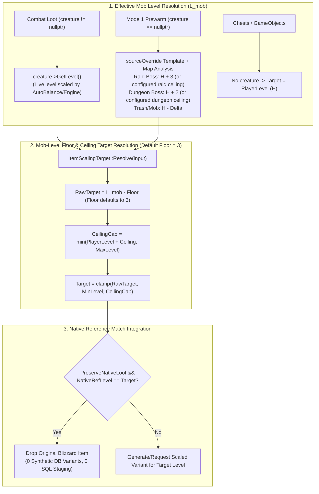

# Implementation Plan: Dynamic Scaling Based on Current In-Instance Mob Level (Default Floor = 3)

## 1. Goal Description & Problem Statement

### The Problem
In dungeons and raids, creatures are dynamically scaled by modules such as AutoBalance or the server engine (e.g., in a level 80 run of Tempest Keep: The Eye, Void Reaver is scaled to level 83 due to the +3 raid skull offset, and trash mobs are scaled to level 80).

Previously, `mod-item-level-scaling` determined the scaling target via:
$$\Delta = \text{instanceMaxLevel} - \text{creatureSourceLevel}$$
$$\text{Target} = \text{clamp}(\text{PlayerLevel} + \text{Ceiling} - \Delta,\ \text{PlayerLevel} - \text{Floor},\ \text{PlayerLevel} + \text{Ceiling})$$

Because `instanceMaxLevel` was pulled from Wrath `LFGDungeons.dbc` (which lists 83 for Tempest Keep), while `creatureSourceLevel` was pulled from native TBC `creature_template` (73 for Void Reaver), the formula produced a false cross-expansion delta of $\Delta = 83 - 73 = 10$.
With $\text{Ceiling} = 0$ and $\text{Floor} = 5$:
- $\text{RawTarget} = 80 + 0 - 10 = 70$.
- Clamped to minimum floor: $80 - 5 = 75$.
- As a result, Void Reaver and all trash dropped level 75 items instead of level 80/78 items.

Furthermore, `ItemScalingTarget::Resolve` checked `if (IsExternallyScaledCreature(input) && !input.realPlayersOnly)`. Because `input.realPlayersOnly` defaults to `true`, the scaled level `observedCreatureLevel` was completely ignored!

### The Desired Solution & Default Floor = 3
1. **Dynamic scaling is calculated directly from the current/scaled level of the mob in the instance** ($L_{\text{mob}}$):
   $$\text{RawTarget} = L_{\text{mob}} - \text{Floor}$$
   $$\text{Target} = \text{clamp}\Big(\text{RawTarget},\ \text{MinLevel},\ \min(\text{PlayerLevel} + \text{Ceiling},\ \text{MaxLevel})\Big)$$
2. **Default Floor = 3 Across All Categories**:
   Update all default dynamic floor configuration values from `5` to `3` across all dungeons, heroic dungeons, and raids:
   - `ItemScaling.Dynamic.Floor.Dungeons = 3`
   - `ItemScaling.Dynamic.Floor.Raids = 3`
   - `ItemScaling.Dynamic.Floor.HeroicDungeons = 3` (including TBC & Wrath)
   - `ItemScaling.Dynamic.Floor.HeroicRaids = 3`
   - `ItemScaling.Dynamic.Floor.Raid10M = 3`, `Raid10MHeroic = 3`
   - `ItemScaling.Dynamic.Floor.Raid15M = 3`, `Raid20M = 3`
   - `ItemScaling.Dynamic.Floor.Raid25M = 3`, `Raid25MHeroic = 3`
   - `ItemScaling.Dynamic.Floor.Raid40M = 3`

#### Concrete Gameplay Impact with Default $\text{Floor} = 3$ (at Player Level 80, $\text{Ceiling} = 0$):
- **All Raid Skull Bosses** ($L_{\text{mob}} = 80 + 3 = \mathbf{83}$):
  - $\text{Target} = 83 - 3 = \mathbf{80}$ $\implies$ **Drops max level 80 items by default!**
- **All Raid Trash Mobs** ($L_{\text{mob}} = \mathbf{80}$):
  - $\text{Target} = 80 - 3 = \mathbf{77}$ $\implies$ **Drops level 77 items by default.**
- **5-Man Dungeon Bosses** ($L_{\text{mob}} = 80 + 2 = \mathbf{82}$):
  - $\text{Target} = 82 - 3 = \mathbf{79}$ $\implies$ **Drops level 79 items by default** (or 80 if boss ceiling is 3, or if Floor is set to 2).
- **5-Man Dungeon Trash Mobs** ($L_{\text{mob}} = \mathbf{80}$):
  - $\text{Target} = 80 - 3 = \mathbf{77}$ $\implies$ **Drops level 77 items by default.**
- **Native Content Runs (e.g. Level 70 Player in Tempest Keep / Black Temple)**:
  - Boss level is $70 + 3 = 73$.
  - $\text{Target} = 73 - 3 = \mathbf{70}$.
  - Native boss loot is level 70 $\implies$ **Native Reference Match Bypass** triggers and drops the **original Blizzard item** without generating any synthetic database variants!

---

## 2. Architectural Invariants & Data Flow



---

## 3. Parity Between Live Combat and Mode 1 Prewarm

A critical requirement is that **Mode 1 Prewarm** (which runs when a player enters the map without any creatures engaged) and **Mode 2 / Live Combat** (when the creature is killed and drops loot) compute the **exact same target level**.

| Context | Creature Pointer | Source of $L_{\text{mob}}$ | Example (Raid Boss at Player 80) | Target with Default Floor 3 |
| :--- | :--- | :--- | :--- | :--- |
| **Live Combat** | `creature != nullptr` | `creature->GetLevel()` (set by AutoBalance to 83) | $L_{\text{mob}} = 83$ | $83 - 3 = \mathbf{80}$ |
| **Mode 1 Prewarm** | `creature == nullptr` | `sourceOverride` template rank (`WORLDBOSS` in Raid $\implies H + 3$) | $L_{\text{mob}} = 80 + 3 = 83$ | $83 - 3 = \mathbf{80}$ |
| **Parity Result** | **MATCH** | Identical effective mob level | $\mathbf{83} \equiv \mathbf{83}$ | $\mathbf{80} \equiv \mathbf{80}$ |

---

## 4. Detailed Component Changes

### A. Configuration & Defaults: [`src/ItemScalingConfig.h`](file:///C:/Users/Admin/AntigravityProfiles/Projects%20Azerothcore/Azerothcore%20modules/mod-item-level-scaling/src/ItemScalingConfig.h) & [`src/ItemScalingConfig.cpp`](file:///C:/Users/Admin/AntigravityProfiles/Projects%20Azerothcore/Azerothcore%20modules/mod-item-level-scaling/src/ItemScalingConfig.cpp)
- Change default values of all `DynamicFloor*` member variables from `5` to `3`:
  - `DynamicFloorDungeons{3}`
  - `DynamicFloorRaids{3}`
  - `DynamicFloorHeroicDungeons{3}`
  - `DynamicFloorHeroicDungeonsTBC{3}`
  - `DynamicFloorHeroicDungeonsWrath{3}`
  - `DynamicFloorHeroicRaids{3}`
  - `DynamicFloorRaid10M{3}`, `DynamicFloorRaid10MHeroic{3}`
  - `DynamicFloorRaid15M{3}`, `DynamicFloorRaid20M{3}`
  - `DynamicFloorRaid25M{3}`, `DynamicFloorRaid25MHeroic{3}`
  - `DynamicFloorRaid40M{3}`
- Update fallback values in `sConfigMgr->GetOption<uint32>("ItemScaling.Dynamic.Floor.*", 3)` in `ItemScalingConfig.cpp`.
- Update [`conf/mod_item_level_scaling.conf.dist`](file:///C:/Users/Admin/AntigravityProfiles/Projects%20Azerothcore/Azerothcore%20modules/mod-item-level-scaling/conf/mod_item_level_scaling.conf.dist) and comments to reflect default `3`.

### B. Core Mathematical Engine: [`src/ItemScalingTarget.h`](file:///C:/Users/Admin/AntigravityProfiles/Projects%20Azerothcore/Azerothcore%20modules/mod-item-level-scaling/src/ItemScalingTarget.h)
- Refactor `ItemScalingTarget::Resolve`:
  1. Remove the incorrect `!input.realPlayersOnly` gate.
  2. Treat `input.observedCreatureLevel` as the effective mob level $L_{\text{mob}}$.
  3. Apply the new formula:
     ```cpp
     if (input.dynamic && input.hasCreature)
     {
         std::int32_t mobLevel = static_cast<std::int32_t>(input.observedCreatureLevel);
         std::int32_t raw = mobLevel - static_cast<std::int32_t>(input.floor);

         std::int32_t ceilingLevel = std::min<std::int32_t>(
             static_cast<std::int32_t>(playerLevel) + static_cast<std::int32_t>(input.ceiling),
             static_cast<std::int32_t>(maximum));

         std::int32_t floorLevel = static_cast<std::int32_t>(minimum);
         target = static_cast<std::uint8_t>(std::clamp<std::int32_t>(raw, floorLevel, ceilingLevel));
     }
     ```
  4. Chests and GameObjects (`!input.hasCreature`) continue to scale directly to `playerLevel` (clamped to ceiling/minimum).
  5. Fixed mode (`!input.dynamic`) continues to set `target = playerLevel`.

### C. Loot Hook & Level Resolution: [`src/ItemScalingLootScript.cpp`](file:///C:/Users/Admin/AntigravityProfiles/Projects%20Azerothcore/Azerothcore%20modules/mod-item-level-scaling/src/ItemScalingLootScript.cpp)
- In `ResolveTargetLevels`:
  - **Live Creature (`creature != nullptr`)**:
    Authoritative level is `creature->GetLevel()`. If AutoBalance or the server has scaled the creature (e.g. to 83), this value is directly passed as `targetInput.observedCreatureLevel`.
  - **Prewarm / Template (`creature == nullptr && sourceOverride != nullptr`)**:
    Accurately estimate the spawned creature's level:
    - If in a Raid (`map->IsRaid()`):
      - Raid Boss (`rank == CREATURE_ELITE_WORLDBOSS` or `flags_extra & CREATURE_FLAG_EXTRA_INSTANCE_BIND`): $L_{\text{mob}} = H + \text{RaidCeilingOffset}$ (default +3, matching AutoBalance default and Blizzard raid skull).
      - Trash / Elite: $L_{\text{mob}} = H - \Delta_{\text{native}}$.
    - If in a 5-Man Dungeon (`map->IsDungeon() && !map->IsRaid()`):
      - Dungeon Boss (`rank == CREATURE_ELITE_RAREELITE || rank == CREATURE_ELITE_WORLDBOSS`): $L_{\text{mob}} = H + \text{DungeonCeilingOffset}$ (default +2, matching AutoBalance default).
      - Trash / Elite: $L_{\text{mob}} = H - \Delta_{\text{native}}$.
  - Pass the determined $L_{\text{mob}}$ to `targetInput.observedCreatureLevel`.
  - Eliminate the old cross-expansion calculation that mixed `LFGDungeons.dbc::MaxLevel` with `creature_template::maxlevel`.

### D. Unit Test Suite: [`tests/test_target_level.cpp`](file:///C:/Users/Admin/AntigravityProfiles/Projects%20Azerothcore/Azerothcore%20modules/mod-item-level-scaling/tests/test_target_level.cpp)
- Update existing test assertions and add new dedicated tests reflecting default `Floor = 3`:
  - Raid Boss (Level 83):
    - Default Floor 3 $\implies$ 80.
    - Floor 5 $\implies$ 78.
    - Floor 0 $\implies$ 80 (capped by player level 80 + ceiling 0).
  - Trash Mob (Level 80):
    - Default Floor 3 $\implies$ 77.
    - Floor 5 $\implies$ 75.
    - Floor 0 $\implies$ 80.
  - 5-Man Dungeon Boss (Level 82):
    - Default Floor 3 $\implies$ 79.
    - Floor 2 $\implies$ 80.
    - Floor 5 $\implies$ 77.
    - Floor 0 $\implies$ 80.
  - Level 70 Player in Tempest Keep (Native Level 70 content):
    - Boss (Level 73), Default Floor 3 $\implies$ 70 (triggers native match bypass $\implies$ original Blizzard item).
    - Boss (Level 73), Floor 5 $\implies$ 68.
  - Chests / GameObjects (`hasCreature = false`) $\implies$ scales to player level.
  - Fixed scaling mode (`dynamic = false`) $\implies$ scales to player level.

---

## 5. Verification & Testing Plan

1. **Test Compilation**:
   - Compile and execute the standalone test suite:
     ```powershell
     cl.exe /std:c++17 /EHsc /I src tests/test_target_level.cpp
     .\test_target_level.exe
     ```
   - Verify 100% of assertions pass.
2. **Invariants Compliance**:
   - **Zero Blocking I/O**: `ItemScalingTarget::Resolve` and `ResolveTargetLevels` contain only arithmetic and memory reads.
   - **No Pointer Cross-Tick Storage**: Creature pointers are used only ephemerally during the loot hook.
   - **Idempotency**: No database schema changes needed.
   - **Zero Binary Drift**: No worldserver compilation or installation performed (adhering strictly to user prompt).

---

## 6. Acceptance Matrix (Default Floor = 3)

| Scenario | Player Level | Mob / Source | Mob Level ($L_{\text{mob}}$) | Ceiling | Floor | Calculated Target | Loot Result |
| :--- | :---: | :--- | :---: | :---: | :---: | :---: | :--- |
| **All Raid Bosses (e.g. Void Reaver, Ragnaros, Illidan)** | 80 | Raid Boss | 83 | 0 | **3 (Default)** | **80** | **Scaled Level 80 Variant** |
| **All Raid Bosses** | 80 | Raid Boss | 83 | 0 | 5 | **78** | Scaled Level 78 Variant |
| **All Raid Bosses** | 80 | Raid Boss | 83 | 0 | 0 | **80** | Scaled Level 80 Variant |
| **All Raid Trash Mobs** | 80 | Trash Mob | 80 | 0 | **3 (Default)** | **77** | **Scaled Level 77 Variant** |
| **All Raid Trash Mobs** | 80 | Trash Mob | 80 | 0 | 5 | **75** | Scaled Level 75 Variant |
| **All Raid Trash Mobs** | 80 | Trash Mob | 80 | 0 | 0 | **80** | Scaled Level 80 Variant |
| **5M Dungeon Bosses** | 80 | Dungeon Boss | 82 | 0 | **3 (Default)** | **79** | Scaled Level 79 Variant |
| **5M Dungeon Bosses** | 80 | Dungeon Boss | 82 | 0 | 2 | **80** | Scaled Level 80 Variant |
| **5M Dungeon Bosses** | 80 | Dungeon Boss | 82 | 0 | 0 | **80** | Scaled Level 80 Variant |
| **Native Raid Run (e.g. Level 70 in TK/BT)** | 70 | Raid Boss | 73 | 0 | **3 (Default)** | **70** | **Original Blizzard Item** (Native Bypass) |
| **Native Raid Run** | 70 | Raid Boss | 73 | 0 | 5 | **68** | Downscaled Level 68 Variant |
