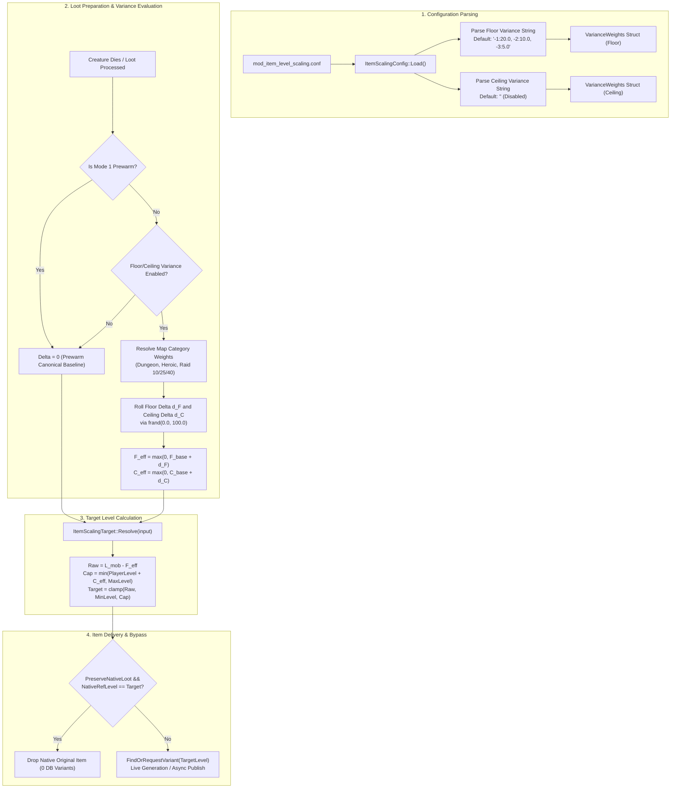

# Implementation Plan: Configurable Weighted Linear Variance for Dynamic Floor and Ceiling (±1, ±2, ±3 Levels)

## 1. Goal Description & Problem Statement

### The Problem & Motivation
Currently, in `mod-item-level-scaling`, the Dynamic Floor ($F$) and Dynamic Ceiling ($C$) are static integer constants configured per instance category (e.g., Dungeons = 3, Raids = 3).
Under the current mob-level dynamic formula:
$$\text{RawTarget} = L_{\text{mob}} - \text{Floor}$$
$$\text{Target} = \text{clamp}\Big(\text{RawTarget},\ \text{MinLevel},\ \min(\text{PlayerLevel} + \text{Ceiling},\ \text{MaxLevel})\Big)$$

For example, when a level 80 player runs a 5-man dungeon:
- The dungeon boss is scaled by the engine/AutoBalance to level **82** (level 80 + 2 dungeon boss ceiling).
- With a static $\text{Floor} = 3$: $\text{RawTarget} = 82 - 3 = \mathbf{79}$.
- Every dungeon boss kill deterministically drops level 79 items.
- There is currently no mechanism for a dungeon boss to "high-roll" a drop or surprise players with a max-level (level 80) item unless the administrator permanently lowers the floor to 2 across the board.

### The Desired Feature & Updated Defaults
Introduce **configurable random variance** with **linear percentage chances** for shifts of **$\pm 1, \pm 2, \pm 3$ levels** to Dynamic Floor and Dynamic Ceiling:

1. **Floor Variance is ENABLED by Default**:
   - `ItemScaling.Dynamic.Floor.Variance.Enable = 1` (**Enabled by default**)
   - Default linear distribution totaling **35%** (well below 50%):
     - **$-1$ (20.0% chance)**: Lucky roll $\implies \text{Floor} = 2$. Dungeon bosses drop **level 80** items!
     - **$-2$ (10.0% chance)**: Great roll $\implies \text{Floor} = 1$. Dungeon trash drops level 79 items.
     - **$-3$ (5.0% chance)**: Jackpot roll $\implies \text{Floor} = 0$. Mob level directly equals target level!
     - **Remaining 65.0% chance**: Unmodified baseline ($\text{Floor} = 3$). Standard dungeon bosses drop level 79 items.
2. **Ceiling Variance is DISABLED by Default**:
   - `ItemScaling.Dynamic.Ceiling.Variance.Enable = 0` (**Disabled by default**)
   - Base Dynamic Ceiling remains strictly **0** across all categories, ensuring loot never drops above player level unless an administrator intentionally turns ceiling variance on.
3. **Per-Category Granularity**:
   Configurable percentage distributions for all standard instance categories:
   - Normal 5-man Dungeons
   - Heroic 5-man Dungeons (Generic fallback, TBC, Wrath)
   - Raids (Generic fallback, Heroic fallback)
   - Specific Raid Sizes: 10M, 10M Heroic, 15M, 20M, 25M, 25M Heroic, 40M
4. **Variance Scope Toggle**:
   - `ItemScaling.Dynamic.Variance.Scope = 0` (Default: **Per-Loot / Per-Boss** — all items dropped by that boss share the rolled floor/ceiling).
   - `ItemScaling.Dynamic.Variance.Scope = 1` (**Per-Item** — each scalable item in the loot rolls its variance independently, akin to Warforging).

---

## 2. Viability Analysis: Why -3 is Viable and Valuable

Let's evaluate whether delta **$-3$** is viable when base $\text{Floor} = 3$:

| Mob Type | Mob Level ($L_{\text{mob}}$) at Player 80 | Base Target ($\text{Floor} = 3$) | $-1$ Shift ($\text{Floor} = 2$) [20%] | $-2$ Shift ($\text{Floor} = 1$) [10%] | $-3$ Shift ($\text{Floor} = 0$) [5%] |
| :--- | :--- | :--- | :--- | :--- | :--- |
| **Dungeon Boss** | 82 ($80 + 2$) | $82 - 3 = \mathbf{79}$ | $82 - 2 = \mathbf{80}$ | $82 - 1 = 81 \to \mathbf{80}^*$ | $82 - 0 = 82 \to \mathbf{80}^*$ |
| **Dungeon Trash** | 80 ($80 + 0$) | $80 - 3 = \mathbf{77}$ | $80 - 2 = \mathbf{78}$ | $80 - 1 = \mathbf{79}$ | $80 - 0 = \mathbf{80}$ |
| **Raid Boss** | 83 ($80 + 3$) | $83 - 3 = \mathbf{80}$ | $83 - 2 = 81 \to \mathbf{80}^*$ | $83 - 1 = 82 \to \mathbf{80}^*$ | $83 - 0 = 83 \to \mathbf{80}^*$ |
| **Raid Trash** | 80 ($80 + 0$) | $80 - 3 = \mathbf{77}$ | $80 - 2 = \mathbf{78}$ | $80 - 1 = \mathbf{79}$ | $80 - 0 = \mathbf{80}$ |

*\* Clamped to level 80 by $\min(PlayerLevel + Ceiling, MaxLevel) = \min(80 + 0, 80) = 80$.*

### Key Conclusion:
- Delta **$-3$** is **completely viable, safe, and meaningful**:
  - $\text{Floor} = \max(0, 3 - 3) = \mathbf{0}$. Floor never goes below 0.
  - For bosses, Ceiling ($0$) safely prevents drops from exceeding player level 80.
  - For **trash mobs and rare elites**, delta **$-3$** provides an exciting **"Jackpot Drop"** (5% chance) where trash can drop a max level 80 item!
  - Therefore, keeping `"-1:20.0, -2:10.0, -3:5.0"` (total 35%) provides a natural linear tiering:
    - Common upgrade: Boss drops 80 (20%)
    - Rare upgrade: Trash drops 79 (10%)
    - Jackpot upgrade: Trash drops 80 (5%)

---

## 3. Mathematical Mechanics: Floor vs. Ceiling Variance

### A. Floor Variance Mechanics (Target Level Offset)
The effective floor is computed as:
$$F_{\text{eff}} = \max(0, F_{\text{base}} + d_F), \quad d_F \in \{-3, -2, -1, 0, +1, +2, +3\}$$

Because the target formula subtracts the floor ($\text{RawTarget} = L_{\text{mob}} - F_{\text{eff}}$):
- **Negative Floor Delta ($d_F < 0$) = UPGRADE (Higher Level Loot)**:
  - Example: Base Floor = 3, Dungeon Boss = 82.
  - If roll yields $d_F = -1 \implies F_{\text{eff}} = 3 + (-1) = \mathbf{2}$.
  - $\text{RawTarget} = 82 - 2 = \mathbf{80}$! **The boss drops a level 80 item instead of level 79!**
  - If roll yields $d_F = -2 \implies F_{\text{eff}} = 3 + (-2) = \mathbf{1} \implies \text{RawTarget} = 82 - 1 = \mathbf{81}$ (clamped to player cap 80).
  - If roll yields $d_F = -3 \implies F_{\text{eff}} = 3 + (-3) = \mathbf{0} \implies \text{RawTarget} = 82 - 0 = \mathbf{82}$ (clamped to player cap 80).
- **Positive Floor Delta ($d_F > 0$) = DOWNGRADE (Lower Level Loot)**:
  - If configured, $d_F = +1 \implies F_{\text{eff}} = 3 + 1 = \mathbf{4} \implies \text{RawTarget} = 82 - 4 = \mathbf{78}$.

### B. Ceiling Variance Mechanics (Maximum Clamp Cap)
The effective ceiling is computed as:
$$C_{\text{eff}} = \max(0, C_{\text{base}} + d_C), \quad d_C \in \{-3, -2, -1, 0, +1, +2, +3\}$$
$$\text{CeilingCap} = \min(P_{\text{player}} + C_{\text{eff}},\ \text{MaxLevel})$$

Because Ceiling Variance is **disabled by default** (`ItemScaling.Dynamic.Ceiling.Variance.Enable = 0`) and base Ceiling is **0**:
- $C_{\text{eff}} = 0$ by default.
- $\text{CeilingCap} = \min(\text{PlayerLevel} + 0, 80) = \text{PlayerLevel}$.
- Items never exceed the player's level unless the administrator explicitly enables ceiling variance.

---

## 4. Probability & Rolling Algorithm

Let the configured linear percentage weights for deltas $\{-3, -2, -1, +1, +2, +3\}$ be:
$$W_{-3}, W_{-2}, W_{-1}, W_{+1}, W_{+2}, W_{+3} \ge 0.0$$
Total configured weight:
$$S = \sum_{i} W_i$$

Under our default setting `"-1:20.0, -2:10.0, -3:5.0"`:
- $W_{-1} = 20.0\%$
- $W_{-2} = 10.0\%$
- $W_{-3} = 5.0\%$
- Total $S = 35.0\%$

### Execution Steps:
1. If $S == 0.0$ or variance is disabled: return delta $0$.
2. If $S \le 100.0$:
   - Roll a uniform float $R \in [0.0, 100.0)$ via `frand(0.0f, 100.0f)`.
   - If $R < 20.0 \implies d = -1$ (20.0% chance)
   - Else if $R < 20.0 + 10.0 = 30.0 \implies d = -2$ (10.0% chance)
   - Else if $R < 30.0 + 5.0 = 35.0 \implies d = -3$ (5.0% chance)
   - Else ($R \ge 35.0$) $\implies d = 0$ (**65.0% chance — base Floor 3 used**).
3. If $S > 100.0$:
   - Roll $R \in [0.0, S)$ and evaluate intervals against normalized sum.

---

## 5. Architectural Invariants & Data Flow



---

## 6. Updated Configuration Schema & Defaults

### Master Toggles
```ini
#
#    ItemScaling.Dynamic.Floor.Variance.Enable
#        Description: Enable random variance shifts (±1, ±2, ±3) for dynamic floor calculations.
#                     Allows dungeon/raid creatures a chance to roll a lower floor, dropping higher level items.
#        Default:     1 - Enabled (roll weighted variance per loot drop)
#                     0 - Disabled (strictly use static floor values)
#
ItemScaling.Dynamic.Floor.Variance.Enable = 1

#
#    ItemScaling.Dynamic.Ceiling.Variance.Enable
#        Description: Enable random variance shifts (±1, ±2, ±3) for dynamic ceiling calculations.
#        Default:     0 - Disabled (strictly use static ceiling values of 0)
#                     1 - Enabled (roll weighted variance per loot drop)
#
ItemScaling.Dynamic.Ceiling.Variance.Enable = 0

#
#    ItemScaling.Dynamic.Variance.Scope
#        Description: Defines when variance rolls occur:
#                     0 - Per-Loot / Per-Boss (All items dropped by the boss share the rolled floor/ceiling) [Default]
#                     1 - Per-Item (Each eligible scalable item in the loot rolls variance independently)
#        Default:     0
#
ItemScaling.Dynamic.Variance.Scope = 0
```

### Floor Variance Categories (Defaulting to Linear 35% Total)
```ini
#
#    Dynamic Floor Variance Distributions
#        Format:      "-3:<pct>, -2:<pct>, -1:<pct>, +1:<pct>, +2:<pct>, +3:<pct>"
#                     Negative deltas (-1, -2, -3) REDUCE floor, dropping HIGHER level items!
#                     -1: 20.0% chance (Floor 3 -> 2: Dungeon boss at 82 drops level 80 loot!)
#                     -2: 10.0% chance (Floor 3 -> 1: Dungeon trash at 80 drops level 79 loot!)
#                     -3:  5.0% chance (Floor 3 -> 0: Jackpot! Trash at 80 drops level 80 loot!)
#                     Remaining 65.0% chance uses standard baseline Floor = 3.
#        Default:     "-1:20.0, -2:10.0, -3:5.0"
#

ItemScaling.Dynamic.Floor.Variance.Dungeons = "-1:20.0, -2:10.0, -3:5.0"
ItemScaling.Dynamic.Floor.Variance.HeroicDungeons = "-1:20.0, -2:10.0, -3:5.0"
ItemScaling.Dynamic.Floor.Variance.HeroicDungeons.TBC = "-1:20.0, -2:10.0, -3:5.0"
ItemScaling.Dynamic.Floor.Variance.HeroicDungeons.Wrath = "-1:20.0, -2:10.0, -3:5.0"
ItemScaling.Dynamic.Floor.Variance.Raids = "-1:20.0, -2:10.0, -3:5.0"
ItemScaling.Dynamic.Floor.Variance.HeroicRaids = "-1:20.0, -2:10.0, -3:5.0"
ItemScaling.Dynamic.Floor.Variance.Raid10M = "-1:20.0, -2:10.0, -3:5.0"
ItemScaling.Dynamic.Floor.Variance.Raid10MHeroic = "-1:20.0, -2:10.0, -3:5.0"
ItemScaling.Dynamic.Floor.Variance.Raid15M = "-1:20.0, -2:10.0, -3:5.0"
ItemScaling.Dynamic.Floor.Variance.Raid20M = "-1:20.0, -2:10.0, -3:5.0"
ItemScaling.Dynamic.Floor.Variance.Raid25M = "-1:20.0, -2:10.0, -3:5.0"
ItemScaling.Dynamic.Floor.Variance.Raid25MHeroic = "-1:20.0, -2:10.0, -3:5.0"
ItemScaling.Dynamic.Floor.Variance.Raid40M = "-1:20.0, -2:10.0, -3:5.0"
```

### Ceiling Variance Categories (Default Disabled / Empty)
```ini
#
#    Dynamic Ceiling Variance Distributions
#        Format:      "-3:<pct>, -2:<pct>, -1:<pct>, +1:<pct>, +2:<pct>, +3:<pct>"
#                     Positive deltas (+1, +2, +3) expand the ceiling cap above player level.
#        Default:     "" (Disabled; base ceiling is 0)
#

ItemScaling.Dynamic.Ceiling.Variance.Dungeons = ""
ItemScaling.Dynamic.Ceiling.Variance.HeroicDungeons = ""
ItemScaling.Dynamic.Ceiling.Variance.HeroicDungeons.TBC = ""
ItemScaling.Dynamic.Ceiling.Variance.HeroicDungeons.Wrath = ""
ItemScaling.Dynamic.Ceiling.Variance.Raids = ""
ItemScaling.Dynamic.Ceiling.Variance.HeroicRaids = ""
ItemScaling.Dynamic.Ceiling.Variance.Raid10M = ""
ItemScaling.Dynamic.Ceiling.Variance.Raid10MHeroic = ""
ItemScaling.Dynamic.Ceiling.Variance.Raid15M = ""
ItemScaling.Dynamic.Ceiling.Variance.Raid20M = ""
ItemScaling.Dynamic.Ceiling.Variance.Raid25M = ""
ItemScaling.Dynamic.Ceiling.Variance.Raid25MHeroic = ""
ItemScaling.Dynamic.Ceiling.Variance.Raid40M = ""
```

---

## 7. Detailed Component Changes

### A. Core Data Structures: [`src/ItemScalingConfig.h`](file:///C:/Users/Admin/AntigravityProfiles/Projects%20Azerothcore/Azerothcore%20modules/mod-item-level-scaling/src/ItemScalingConfig.h)
1. Define `VarianceWeights`:
   ```cpp
   struct VarianceWeights
   {
       // Index 0: -3, Index 1: -2, Index 2: -1, Index 3: +1, Index 4: +2, Index 5: +3
       float chances[6]{0.0f, 0.0f, 0.0f, 0.0f, 0.0f, 0.0f};

       [[nodiscard]] bool HasAny() const
       {
           for (float c : chances)
               if (c > 0.0f)
                   return true;
           return false;
       }
   };
   ```
2. Add master flags:
   - `bool FloorVarianceEnable{true};` (**Default true**)
   - `bool CeilingVarianceEnable{false};` (**Default false**)
   - `uint8 VarianceScope{0};` (**Default 0 - Per-Loot**)
3. Add member variables for Floor & Ceiling variance categories.
4. Declare parser and accessors:
   - `static VarianceWeights ParseVarianceWeights(std::string const& configStr);`
   - `static int8 RollVarianceDelta(VarianceWeights const& weights, float randomRoll = -1.0f);`
   - `VarianceWeights GetDynamicFloorVarianceWeights(Map const* map) const;`
   - `VarianceWeights GetDynamicCeilingVarianceWeights(Map const* map) const;`

### B. Configuration Loading & Ingestion: [`src/ItemScalingConfig.cpp`](file:///C:/Users/Admin/AntigravityProfiles/Projects%20Azerothcore/Azerothcore%20modules/mod-item-level-scaling/src/ItemScalingConfig.cpp)
1. Load `FloorVarianceEnable` (default `true`) and `CeilingVarianceEnable` (default `false`).
2. Implement `ParseVarianceWeights`:
   - Supports key-value pairs (`-1: 20.0, -2: 10.0, -3: 5.0`) and positional comma-separated.
3. Implement `RollVarianceDelta`:
   - Uses `frand(0.0f, 100.0f)`.
   - Correctly handles interval testing where unallocated probability returns `0`.
4. Ingest all Floor categories with default `"-1:20.0, -2:10.0, -3:5.0"`.
5. Ingest all Ceiling categories with default `""`.

### C. Loot Preparation & Variance Integration: [`src/ItemScalingLootScript.cpp`](file:///C:/Users/Admin/AntigravityProfiles/Projects%20Azerothcore/Azerothcore%20modules/mod-item-level-scaling/src/ItemScalingLootScript.cpp)
1. In `ResolveTargetLevels`:
   - If `!prewarm`:
     - If `FloorVarianceEnable`:
       `int8 fDelta = ItemScalingConfig::RollVarianceDelta(sItemScalingConfig->GetDynamicFloorVarianceWeights(map));`
       `targetInput.floor = static_cast<uint8>(std::max<int32>(0, static_cast<int32>(baseFloor) + fDelta));`
     - If `CeilingVarianceEnable`:
       `int8 cDelta = ItemScalingConfig::RollVarianceDelta(sItemScalingConfig->GetDynamicCeilingVarianceWeights(map));`
       `targetInput.ceiling = static_cast<uint8>(std::max<int32>(0, static_cast<int32>(baseCeiling) + cDelta));`
2. In `scaleLootItem`:
   - If `VarianceScope == 1` (Per-Item), re-evaluates the roll per eligible item to allow mixed-level drops on the same boss corpse.
3. Enhanced Debug Logging:
   - When `ItemScaling.Debug` is enabled, print:
     `ItemScaling: Map {} - Target Level: {} (Requested: {}) [Floor: {} (base {}, delta {}), Ceiling: {} (base {}, delta {})]`

### D. Zero Breaking Changes to `ItemScalingTarget::Resolve`
Because `targetInput.floor` and `targetInput.ceiling` directly receive the clamped effective floor and ceiling ($F_{\text{eff}}, C_{\text{eff}}$), [`src/ItemScalingTarget.h`](file:///C:/Users/Admin/AntigravityProfiles/Projects%20Azerothcore/Azerothcore%20modules/mod-item-level-scaling/src/ItemScalingTarget.h) requires zero structural modifications.

---

## 8. Verification & Testing Strategy

### A. Unit Tests: [`tests/test_target_level.cpp`](file:///C:/Users/Admin/AntigravityProfiles/Projects%20Azerothcore/Azerothcore%20modules/mod-item-level-scaling/tests/test_target_level.cpp)
Add automated test suites:
1. `TestVarianceParsing`:
   - Test default string `"-1:20.0, -2:10.0, -3:5.0"`.
   - Verify: Index 2 (-1) = 20.0, Index 1 (-2) = 10.0, Index 0 (-3) = 5.0, others = 0.0.
   - Test positional string: `"5.0, 10.0, 20.0, 0.0, 0.0, 0.0"`.
   - Test empty string returns all zeroes.
2. `TestVarianceRolling`:
   - Test rolls against `"-1:20.0, -2:10.0, -3:5.0"`:
     - $R = 10.0 \implies -1$ (lucky boss drop)
     - $R = 25.0 \implies -2$ (great drop)
     - $R = 32.0 \implies -3$ (jackpot drop)
     - $R = 50.0 \implies 0$ (normal drop)
     - $R = 99.0 \implies 0$ (normal drop)
3. `TestTargetLevelWithVariance`:
   - **Dungeon Boss at Level 80 (Mob Level 82, Base Floor 3)**:
     - Delta 0 $\implies$ Floor 3 $\implies$ Target 79.
     - Delta -1 $\implies$ Floor 2 $\implies$ Target 80 (**20% chance**).
     - Delta -2 $\implies$ Floor 1 $\implies$ Target 81, clamped to 80 (**10% chance**).
     - Delta -3 $\implies$ Floor 0 $\implies$ Target 82, clamped to 80 (**5% chance**).
   - **Dungeon Trash at Level 80 (Mob Level 80, Base Floor 3)**:
     - Delta 0 $\implies$ Floor 3 $\implies$ Target 77.
     - Delta -1 $\implies$ Floor 2 $\implies$ Target 78.
     - Delta -2 $\implies$ Floor 1 $\implies$ Target 79.
     - Delta -3 $\implies$ Floor 0 $\implies$ Target 80 (**5% chance jackpot!**).
   - **Floor Clamping**:
     - Floor 1 with Delta -3 $\implies$ Floor clamped to 0 (never negative).

### B. Lint & Formatting Checks
- Run `tests/check_source.py` to ensure all include guards, trailing whitespace, and coding standards comply with AzerothCore guidelines.
- Validate maintainer skill:
  ```bash
  python "C:\Users\Admin\.codex\skills\.system\skill-creator\scripts\quick_validate.py" ".agents/skills/item-level-scaling-maintainer"
  ```

### C. Issue Tracking & Documentation
- Document the feature in `docs/ARCHITECTURE.md`.
- Log new issue `[MILS-012]` in `docs/ISSUES.md`.
- Update central catalog `COMMANDER/ISSUES.md` with link and status summary.
