# Implementation Plan: Native Reference Match Bypass & ExcludedLevels Removal

## Goal Description
Implement an optimization and correctness enhancement in `mod-item-level-scaling` so that when a requested scaling target level or player level matches an item's native reference level, the module **does not generate, stage, or persist a synthetic scaled variant**. Instead, the original Blizzard item is dropped natively as the loot result.

Per user requirements:
1. **Remove `ItemScaling.ExcludedLevels` completely** from the build, replacing it with the new dynamic configuration option: `ItemScaling.PreserveNativeLoot = 1`.
2. **Support non-live / legacy offline mode (`ItemScaling.Live.Enable = 0`)**: Drops the default original Blizzard item immediately without queuing demand ledger work (`QueueVariantRequest` into `scaled_item_variant_request`) or requiring restarts.
3. **Diverse Boss Levels & Lower-Level Instances**: Ensure diverse boss levels within an instance (e.g., Blackrock Depths: Gerstahn lvl 52 vs Thaurissan lvl 59) work properly with `ItemScaling.Dynamic.Floor = 5` and `ItemScaling.Dynamic.Ceiling = 0`:
   - When players run content at intended levels, mob and boss native drops match the calculated target or player level and drop as native Blizzard items without scaling.
   - When higher-level players run lower content, items properly scale up to the player's level bracket.
4. **Early bypass across both live modes**:
   - **`Live.GenerationMode = 1` (Prewarm)**: Bypasses native matches in catalogue prewarm before allocating preview loot structs or consuming budget ticks.
   - **`Live.GenerationMode = 2` (On Loot Roll)**: Returns original items immediately upon roll before submitting live requests, SQL staging, or deferring loot packets.
5. **AutoBalance Synergy**: `ItemScaling.UseAutoBalanceSettings = 0` remains the default, operating cleanly standalone while supporting AutoBalance when enabled.
6. **Constraint**: **Do NOT compile or install worldserver** after implementation.

---

## Architectural Invariants & Data Flow

```mermaid
flowchart TD
    subgraph NewConfig ["Configuration Layer"]
        CFG1["ItemScaling.PreserveNativeLoot = 1 (Default: Enabled)"]
        CFG2["ItemScaling.UseAutoBalanceSettings = 0 (Default: Standalone)"]
        CFG3["ItemScaling.ExcludedLevels -> REMOVED"]
    end

    subgraph Mode1 ["Live.GenerationMode = 1 (Dungeon Entry / Prewarm)"]
        A1[Player Enters Map] --> B1[Prewarm Iterates Catalogue Sources]
        B1 --> C1[Resolve Target Level for Source Mob/Chest]
        C1 --> D1{"PreserveNativeLoot && IsNativeTargetMatch?"}
        D1 -- Yes: Matches Target or Player --> E1[Skip Item: 0 Allocations, 0 DB Staging, 0 Budget Burned]
        D1 -- No: Levels Differ --> F1[Enqueue Live Variant Request]
    end

    subgraph Mode2 ["Live.GenerationMode = 2 (On Loot Roll) & Non-Live Mode"]
        A2[Creature Dies / Chest Opened] --> B2[PrepareLoot Evaluates Rolled Item]
        B2 --> C2[Resolve Target Level & Bracketing via ResolveTargetLevels]
        C2 --> D2{"PreserveNativeLoot && IsNativeTargetMatch?"}
        D2 -- Yes: Matches Target or Player --> E2["Preserve Original Blizzard Item:\n0 Staging SQL, No Packet Deferral,\nNo Demand Ledger Queueing"]
        D2 -- No: Levels Differ --> F2["FindOrRequest Live Variant / Demand"]
    end

    subgraph Defense ["Authoritative Defense-in-Depth"]
        G[FindOrRequestVariant / QueueVariantRequest] --> H{"PreserveNativeLoot && IsNativeTargetMatch?"}
        H -- Yes --> I[Return 0: Never Allocate Slot or Queue SQL Demand]
        H -- No --> J[Proceed with Registry / Staging]
    end
```

---

## Detailed Component Architecture

### 1. Configuration Files
- **`conf/mod_item_level_scaling.conf.dist`**:
  - Removed `ItemScaling.ExcludedLevels = ""` block.
  - Added `ItemScaling.PreserveNativeLoot = 1` block with comprehensive documentation.
  - Maintained `ItemScaling.UseAutoBalanceSettings = 0` as default.
- **Server Runtime Configs**:
  - Updated `Server/bin/configs/modules/mod_item_level_scaling.conf.dist` and `Server/bin/configs/modules/mod_item_level_scaling.conf` in lockstep.

### 2. Config Struct & Loader
- **`src/ItemScalingConfig.h` & `src/ItemScalingConfig.cpp`**:
  - Removed `std::unordered_set<uint8> ExcludedLevels;` and `bool IsLevelExcluded(uint8 level) const;`.
  - Added `bool PreserveNativeLoot{true};`.
  - Loaded `ItemScaling.PreserveNativeLoot` in `Load()` method (default: `true`).

### 3. Native Level Calculation & Matching Helpers
- **`src/ItemScalingTarget.h`**:
  - Added `GetNativeReferenceLevel(uint8 requiredLevel, uint32 itemLevel)`: returns `requiredLevel > 0 ? requiredLevel : std::clamp(itemLevel, 1, 80)`.
  - Added `IsNativeTargetMatch(uint8 nativeRef, uint8 requestedTarget, uint8 bracketedTarget, uint8 playerLevel = 0)`:
    Returns `true` if `nativeRef == requestedTarget || nativeRef == bracketedTarget || (playerLevel > 0 && nativeRef == playerLevel)`.
- **`src/ItemScalingFormula.h` & `src/ItemScalingFormula.cpp`**:
  - Exposed `GetNativeReferenceLevel(ItemTemplate const* proto)`.
  - Exposed `IsNativeTargetMatch(ItemTemplate const* proto, uint8 requestedTarget, uint8 bracketedTarget, uint8 playerLevel = 0)`.

### 4. Authoritative Loot Target Resolution & Loot Script
- **`src/ItemScalingLootScript.h` & `src/ItemScalingLootScript.cpp`**:
  - Added `ItemScalingLootScript::ResolveTargetLevels(map, lootOwner, sourceOverride, creature, outRequestedTarget, outBracketedTarget, outHighestRealPlayerLevel)`.
  - Called `ResolveTargetLevels` from `PrepareLoot`.
  - In `scaleLootItem`:
    - Removed call to `IsLevelExcluded`.
    - Checked `sItemScalingConfig->PreserveNativeLoot && ItemScalingFormula::IsNativeTargetMatch(baseProto, requestedTarget, lTarget, highestRealPlayerLevel)`.
    - If matched, logs debug information and returns early (leaving original Blizzard item intact).

### 5. Mode 1 Prewarm & Mode 2 Optimization
- **`src/ItemScalingLive.cpp`**:
  - In `ItemScalingLive::Impl::Prewarm`:
    - Resolves target level for the catalogue source.
    - Checks `sItemScalingConfig->PreserveNativeLoot && ItemScalingFormula::IsNativeTargetMatch(proto, requestedTarget, bracketedTarget, level)`.
    - If matched, advances `visit.itemIndex` without burning budget or allocating `preview`.
  - In `ItemScalingLive::FindOrRequest`:
    - Added defense-in-depth check for `PreserveNativeLoot && IsNativeTargetMatch(...)`.

### 6. Registry & Demand Ledger Bypass
- **`src/ItemScalingRegistry.cpp`**:
  - In `ItemScalingRegistry::FindOrRequestVariant`:
    - Added defense-in-depth check for `PreserveNativeLoot && IsNativeTargetMatch(...)`.
    - Prevents `QueueVariantRequest` when `Live.Enable = 0` or offline generation is active, keeping `scaled_item_variant_request` clean.

### 7. GM Commands & Diagnostics
- **`src/ItemScalingCommands.cpp`**:
  - Removed `IsLevelExcluded` reporting.
  - Reported `PreserveNativeLoot` status and preview native match bypass behavior.

### 8. Verification & Test Suite
- Updated `tests/test_target_level.cpp` with acceptance cases:
  - `H=70`, BT native=70, ceiling=0, target=70 -> `IsNativeTargetMatch` true.
  - `H=80`, BT native=70, target=80 -> `IsNativeTargetMatch` false.
  - `H=60`, MC native=60, target=60 -> `IsNativeTargetMatch` true.
  - `H=70`, MC native=60, target=70 -> `IsNativeTargetMatch` false.
  - `H=70`, native=80, target=70 -> `IsNativeTargetMatch` false.
  - `native=70`, `requestedTarget=71`, `bracketedTarget=70` -> `IsNativeTargetMatch` true.
  - Lower level: `H=20`, native=20, target=20 -> true.
  - Lower level: `H=20`, mob native=18, target=18 -> true.
  - Diverse boss: `H=52`, BRD Gerstahn native=47, target=47 -> true.
  - Diverse boss: `H=52`, BRD Gerstahn native=52, player=52 -> true.
- Updated `tests/check_source.py` (verified `PreserveNativeLoot` and removal of `ExcludedLevels`).
- Ran Python validations.
- Recorded `[MILS-010]` in `docs/ISSUES.md` and `../COMMANDER/ISSUES.md`.
