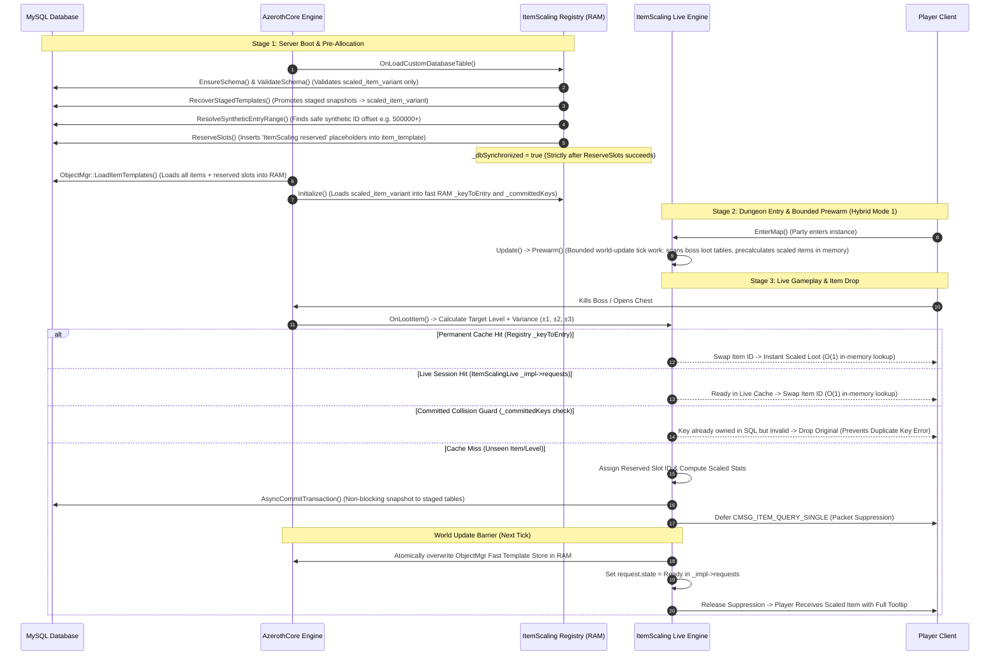
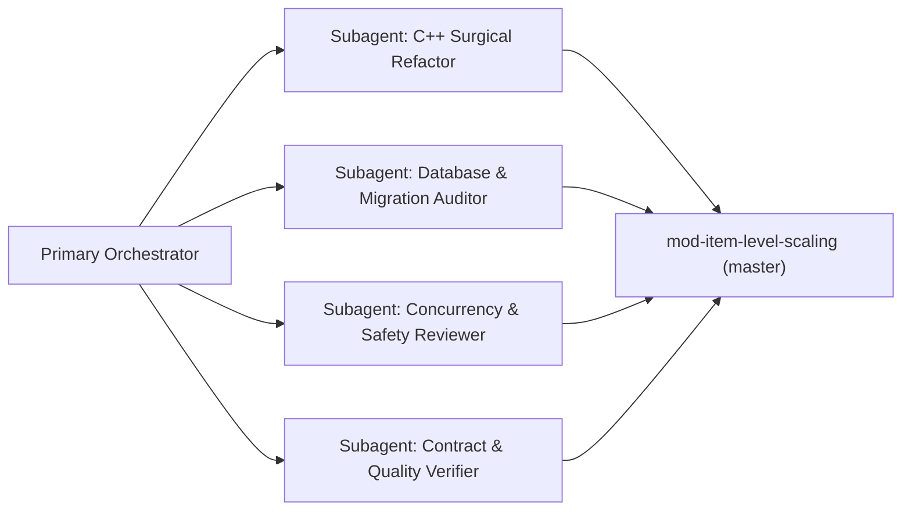

# Implementation Plan: Pure Live Generation Architecture (Master Default)

## Executive Summary

This plan governs the transition of the primary repository:
`C:\Users\Admin\AntigravityProfiles\Projects Azerothcore\Azerothcore modules\mod-item-level-scaling` (branch: `master`)

to become the **authoritative, pure live-scaling module without the legacy Demand Ledger**. The previous demand-ledger codebase has been safely moved and archived at:
`C:\Users\Admin\AntigravityProfiles\Projects Azerothcore\Azerothcore modules\mod-item-level-scaling - Demand-Ledger`

The updated module operates on **Pure Live Generation (Hybrid Mode 1: bounded world-update prewarm + on-demand asynchronous variant creation)**. All generated scaled item templates are permanently persisted in MySQL (`scaled_item_variant`), providing immediate scaling on drop, $O(1)$ in-memory lookups with no database round-trip, immutable startup safety, and zero wait time for server restarts.

> [!IMPORTANT]
> **Architectural Decisions & Scope Bounds**:
> - **Retain Hybrid Mode 1**: Hybrid Mode 1 (bounded world-update prewarm + on-demand live fallback) remains the authoritative default. The proposal to demote or replace Mode 1 with Mode 2 is rejected.
> - **Preserve Committed Key Collision Guard**: `_requestedKeys` is NOT deleted; it is renamed to `_committedKeys` and acts as an immutable collision guard against MySQL `Duplicate entry for key 'uk_variant_key'` crashes.
> - **Two-Tier Cache Hierarchy**: `ItemScalingRegistry::_keyToEntry` remains the strictly immutable registry of startup-loaded permanent variants. Current-session live variants are managed inside `ItemScalingLive::_impl->requests`. Live generation does NOT write into `_keyToEntry`.
> - **Accurate Threading & Concurrency Model**: Prewarming executes as bounded world-thread work after map workers have joined (`LiveMaxPublishPerTick` budget per update), performing zero blocking DB I/O. `ItemScalingRegistry` lookups are lock-free and immutable, while live session operations in `ItemScalingLive` remain synchronized via `_impl->mutex`.
> - **Full Materializer Dead-Code Elimination**: All startup ledger materialization helpers (`BuildItemTemplateInsertSQL`, `BaseColumns`, `ReadBaseTemplate`, `KeyPredicate`, `DeleteRequest`, `DeleteCompletedRequest`, `VariantInsert`, `CommitBatch`, and `MaterializePendingRequests`) are completely removed.
> - **Historical Migration Immutability**: Historical migration `2026_09_27_00_item_scaling_initial_schema.sql` remains intact. The ledger table is safely retired via a new idempotent migration `2026_10_05_00_retire_demand_ledger.sql`.
> - **Issue Tracker Allocation**: Tracked under issue ID **`[MILS-013]`** in `docs/ISSUES.md`.

---

## 1. Operational Lifecycle Timeline: How the Module Runs



### Detailed Breakdown of Execution Stages

#### Stage 1: Server Boot & Pre-Allocation (`OnLoadCustomDatabaseTable` & `Initialize`)
1. **Schema Check (`EnsureSchema` & `ValidateSchema`)**:
   - Ensures `scaled_item_variant` and live staging tables exist in MySQL with matching InnoDB engines and `utf8mb4` collation.
   - Validates that the active schema only expects 2 core tables (`item_template` and `scaled_item_variant`).
2. **Promote Staged Snapshots (`RecoverStagedTemplates`)**:
   - If the server previously crashed or rebooted while live items were being generated, this promotion executes:
     ```sql
     INSERT INTO item_template SELECT * FROM mod_item_level_scaling_staged_item;
     INSERT INTO scaled_item_variant SELECT * FROM mod_item_level_scaling_staged_variant;
     DELETE FROM mod_item_level_scaling_staged_item;
     DELETE FROM mod_item_level_scaling_staged_variant;
     ```
   - **Zero Item Loss**: All items issued in previous sessions become permanently baked into the core tables.
3. **Synthetic Entry Allocation (`ResolveSyntheticEntryRange`)**:
   - Queries `MAX(entry)` across `item_template` and `scaled_item_variant` to safely initialize `_nextSyntheticEntry` above all native items.
4. **Pre-Allocating Placeholder Slots (`ReserveSlots`)**:
   - Pre-creates empty placeholder items in `item_template` (`name = 'ItemScaling reserved'`) and registers them in `mod_item_level_scaling_slot`.
   - **Why this is critical**: AzerothCore's `ItemTemplateStoreFast` is a flat `std::vector` indexed directly by item ID. Pre-allocating placeholder entries ensures the RAM vector is sized large enough *before* runtime, eliminating vector reallocation segmentation faults.
5. **Strict Synchronization Ordering**:
   - `_dbSynchronized` is set to `true` **only after** `ReserveSlots()` successfully completes:
     ```cpp
     if (!sItemScalingLive->ReserveSlots())
     {
         LOG_ERROR("module.ItemScaling", "Could not reserve live slots; stopping startup before player login.");
         _dbSynchronized = false;
         World::StopNow(ERROR_EXIT_CODE);
         return;
     }
     _dbSynchronized = true;
     ```
6. **Core Template Load (`ObjectMgr::LoadItemTemplates`)**:
   - AzerothCore reads the entire `item_template` table into its internal RAM vector (`ItemTemplateStoreFast`), including native items, previously scaled variants, and pre-reserved placeholder slots.
7. **Fast RAM Indexing & Collision Guard (`Initialize`)**:
   - Reads every existing scaled item from `scaled_item_variant`.
   - Inserts every committed key into `_committedKeys` (both valid and invalid templates).
   - Inserts valid templates into `_keyToEntry`:
     $$\text{VariantKey}(\text{baseEntry, targetLevel, targetIlvl, requiredLevel, randomProp}) \longrightarrow \text{variantEntry}$$
   - Marks `_initialized = true`. From this point onward, `_committedKeys` and `_keyToEntry` are **strictly read-only (immutable)**.
   - **Result**: In-game lookups for permanent variants provide **$O(1)$ in-memory lookups with no database round-trip** and zero mutex locking.

---

#### Stage 2: Dungeon Entry & Bounded Prewarm (`EnterMap` / Hybrid Mode 1)
1. **Dynamic Target Level Resolution**:
   - Determines the instance scaling level based on the highest player or dungeon bracket, plus configured floor/ceiling variance ($\pm 1, \pm 2, \pm 3$).
2. **Bounded World-Update Prewarm (`ItemScalingLive::Impl::Prewarm`)**:
   - Executes strictly on the **world thread** during `ItemScalingLive::Update()`, after `MapMgr::Update` has joined all map worker threads.
   - Inspects the dungeon's boss loot tables in slices bounded by `LiveMaxPublishPerTick` catalogue units per update tick.
   - For every equipment item that could drop, checks if a scaled version already exists in permanent registry `_keyToEntry` or live cache `_impl->requests`.
   - If missing, enqueues non-blocking live generation ahead of time without blocking the world loop or executing synchronous DB I/O.

---

#### Stage 3: Item Drop & Live Asynchronous Generation
When a creature dies or a chest is opened (`OnLootItem` / `PrepareChest`):

```text
[Creature Dies / Chest Opened] 
               │
               ▼
1. Calculate Target Level & Apply Dynamic Variance (±1, ±2, ±3)
               │
               ▼
2. Check PreserveNativeLoot:
   Does base item already match target level?
       ├── YES ──> Drop Original Blizzard Item (0 SQL, 0 RAM overhead)
       └── NO  ──> Proceed to Scaling
               │
               ▼
3. Check Permanent RAM Registry (_keyToEntry):
   Does a permanent variant exist?
       ├── YES ──> Swap loot item ID directly (O(1) in-memory lookup)
       └── NO  ──> Check Live Session Cache
               │
               ▼
4. Check Live Session Cache (ItemScalingLive::_impl->requests):
   Is a live variant already Ready?
       ├── YES ──> Swap loot item ID directly (O(1) in-memory lookup)
       └── NO  ──> Check Collision Guard
               │
               ▼
5. Check Committed Collision Guard (_committedKeys):
   Is this key already owned in SQL (even if corrupt/skipped)?
       ├── YES ──> Return 0 / Preserve Original (Prevents Duplicate Key Error 1062)
       └── NO  ──> Proceed to Live Generation
               │
               ▼
6. Trigger Live Generation (Consume Reserved Slot -> Compute -> Async Snapshot -> Publish)
```

**What Happens on a Cache Miss (Live Generation)?**
1. **Slot Allocation**:
   - The engine pops one pre-reserved entry ID from the `slots` queue (e.g. ID `500124`) protected by `_impl->mutex`.
2. **Stat Calculation (`ItemScalingFormula::CreateScaledTemplate`)**:
   - Calculates the scaled item level, armor, attack power, spell power, primary stats (Strength, Agility, Stamina, Intellect, Spirit), and required level.
3. **Snapshot Creation (Persisting to SQL)**:
   - Serializes the exact generated template.
   - Dispatches a non-blocking asynchronous transaction:
     ```sql
     INSERT INTO mod_item_level_scaling_staged_item VALUES (...);
     INSERT INTO mod_item_level_scaling_staged_variant VALUES (...);
     UPDATE mod_item_level_scaling_slot SET assigned = 1 WHERE entry = 500124;
     ```
   - **Zero World-Thread Lag**: `AsyncCommitTransaction` runs in a MySQL worker thread. The game loop never freezes or waits.
4. **Packet Suppression & Loot Deferral**:
   - If the player's client requests the item tooltip (`CMSG_ITEM_QUERY_SINGLE`), the packet is temporarily held in memory.
   - Prevents the client from displaying an empty tooltip or red question mark (`?`).
5. **World Update Publication Barrier (`ItemScalingLive::Update`)**:
   - Once the async SQL write completes, at the start of the next world tick, the engine atomically updates AzerothCore's RAM store:
     ```cpp
     *(*sObjectMgr->GetItemTemplateStoreFast())[entry] = scaledTemplate;
     ```
   - Sets `request.state = Impl::State::Ready` in `_impl->requests` (does NOT write to immutable registry `_keyToEntry`).
   - Releases the held loot window and deferred packets.
   - The player opens the loot window and immediately sees the fully scaled item with accurate tooltips and stats.

---

## 2. When Are Items Saved to SQL? Summary Matrix

| Event | Database Table Affected | Synchronous / Asynchronous | Purpose |
| :--- | :--- | :--- | :--- |
| **Server Startup** | `scaled_item_variant` & `item_template` | Synchronous (`DirectCommitTransaction`) | Promotes staged snapshots left over from previous runs so no items are lost. |
| **Server Startup** | `item_template` & `mod_item_level_scaling_slot` | Synchronous (`DirectCommitTransaction`) | Pre-allocates placeholder slot entries to size the memory vector safely. |
| **Item Drop / Cache Miss** | `mod_item_level_scaling_staged_item` & `mod_item_level_scaling_staged_variant` | **Asynchronous** (`AsyncCommitTransaction`) | Writes complete template snapshot to disk within milliseconds of the drop, without blocking world thread. |
| **Next Server Restart** | `scaled_item_variant` & `item_template` | Synchronous (`DirectCommitTransaction`) | Automatically moves staged records into permanent tables. |

---

## 3. Inventory of Removals & Surgical Edits

### A. Database Layer
1. **Current Base Schemas**:
   - Remove `CREATE TABLE IF NOT EXISTS scaled_item_variant_request` from `data/sql/db-world/base/scaled_item_variant.sql` and `sql/world/base/scaled_item_variant.sql`.
2. **Historical Migrations Preserved Intact**:
   - Keep `data/sql/db-world/updates/2026_09_27_00_item_scaling_initial_schema.sql` unchanged to maintain a valid, immutable migration history.
3. **Idempotent Retirement Migration**:
   - Add new migration `data/sql/db-world/updates/2026_10_05_00_retire_demand_ledger.sql`:
     ```sql
     -- Safely retire legacy demand ledger table
     DROP TABLE IF EXISTS `scaled_item_variant_request`;
     ```
4. **Explicit Ledger Data Retirement Consequence**:
   - Document clearly: rows in `scaled_item_variant_request` represent pending, unmaterialized requests only (not player-owned items). They are safely discarded upon retirement.
   - Before applying the migration, report `SELECT COUNT(*) FROM scaled_item_variant_request;` to make removal deliberate.
   - Live staging tables (`mod_item_level_scaling_staged_*`) and slots (`mod_item_level_scaling_slot`) are strictly retained.
5. **SQL Readme Update**:
   - Update `data/sql/db-world/mod_item_level_scaling_readme.sql` to describe the pure live generation architecture and remove references to startup demand materialization.

### B. Registry & Collision Guard Refactoring (`ItemScalingRegistry.*`)
1. **Retain and Rename `_requestedKeys` $\rightarrow$ `_committedKeys`**:
   - Do NOT delete this set.
   - Rename to `std::unordered_set<VariantKey, VariantKeyHash> _committedKeys;`.
   - Populated during `Initialize()` with all rows from `scaled_item_variant` (including invalid ones).
   - In `FindOrRequestVariant()`: check `if (_committedKeys.count(key)) return 0;`. This guarantees that if a key was committed to SQL but marked invalid, live generation will **never** stage a second synthetic ID for it, preventing `Duplicate entry for key 'uk_variant_key'` crashes on recovery.
2. **Remove `_requestMutex`**:
   - `_committedKeys` and `_keyToEntry` are constructed at startup and become strictly read-only after `_initialized = true`.
   - Because there are zero post-initialization writes to these sets in the registry, lookups are lock-free on the world thread.
3. **Complete Dead-Code Removal (Materializer Sweep)**:
   - Remove `MaterializePendingRequests()`.
   - Remove `QueueVariantRequest()`.
   - Remove `KeyPredicate()`, `DeleteRequest()`, `DeleteCompletedRequest()`, `VariantInsert()`, and `CommitBatch()`.
   - Remove `BuildItemTemplateInsertSQL()`, `BaseColumns`, and `ReadBaseTemplate()`.
   - Remove unnecessary includes (`<optional>`, etc.) associated only with startup materialization.
4. **Startup Schema Verification**:
   - In `EnsureSchema()`: Remove table creation, column migrations, and primary key logic for `scaled_item_variant_request`.
   - In `ValidateSchema()`: Remove loop iteration for `scaled_item_variant_request`; verify InnoDB status for 2 tables (`item_template`, `scaled_item_variant`).
5. **Synchronous Boot Ordering**:
   - In `OnLoadCustomDatabaseTable()`: Set `_dbSynchronized = true` only after `ReserveSlots()` succeeds.
6. **Stale Header Comments Cleanup**:
   - In `src/ItemScalingLive.h`:
     Update comment on `ReserveSlots()`:
     ```cpp
     bool ReserveSlots(); // startup, pre-allocates live generation template slots
     ```
   - In `src/ItemScalingRegistry.h`:
     Update comment on `FindOrRequestVariant()`:
     ```cpp
     // Hits select immutable templates; misses invoke live generation.
     ```

### C. Configuration Layer (`ItemScalingConfig.*` & `conf/`)
1. **Remove Dead Settings**:
   - Remove `ItemScaling.DemandLedger.Enable` from `conf/mod_item_level_scaling.conf.dist`.
   - Remove `ItemScaling.MaxNewVariantsPerStartup` from `conf/mod_item_level_scaling.conf.dist`.
2. **Update Config Struct & Loader**:
   - In `ItemScalingConfig.h`: Remove `bool DemandLedgerEnable` and `uint32 MaxNewVariantsPerStartup`.
   - In `ItemScalingConfig.cpp`: Remove option reading and invariant assertions for `DemandLedgerEnable`.
3. **Update Semantics for `ItemScaling.Live.Enable`**:
   - Keep `ItemScaling.Live.Enable = 1` as default.
   - Document new semantics:
     - `Live.Enable = 1`: Pure Live Generation active (Hybrid Mode 1 bounded prewarm + on-demand async generation).
     - `Live.Enable = 0`: **Persisted-variants-only mode**. Serves existing variants already in `scaled_item_variant`; unseen variants remain original Blizzard items with zero generation or queueing.

### D. Loot & Script Layer (`ItemScalingLootScript.cpp`)
1. **Clean Code & Comments**:
   - Update comments to reflect live generation and remove references to legacy demand queueing.

---

## 4. Multi-Agent Execution Strategy

Execution will leverage specialized subagents with clear verification boundaries:



### Agent Roles & Delegated Responsibilities:
1. **Lead Orchestrator (Current Agent)**:
   - Directs the workflow, sequences edits, reviews intermediate diffs, and synthesizes reports.
2. **Subagent 1: C++ Surgical Refactor (`self` or `pro`)**:
   - Applies the surgical removals to `ItemScalingConfig`, `ItemScalingRegistry`, `ItemScalingLive`, and `ItemScalingLootScript`.
   - Implements `_committedKeys` lock-free lookup and eliminates dead materializer methods (`MaterializePendingRequests`, `BuildItemTemplateInsertSQL`, `BaseColumns`, `CommitBatch`, etc.).
   - Updates comments in `ItemScalingLive.h` and `ItemScalingRegistry.h`.
3. **Subagent 2: Database Migration Auditor (`flash`)**:
   - Cleans base SQL schemas and creates `2026_10_05_00_retire_demand_ledger.sql`.
   - Updates `mod_item_level_scaling_readme.sql`.
   - Verifies MySQL syntax, InnoDB constraints, and idempotency guards.
4. **Subagent 3: Concurrency & Safety Reviewer (`flash` or `pro`)**:
   - Audits all altered code paths for world-thread safety: verifies that prewarm is bounded within `LiveMaxPublishPerTick` after map workers join, verifies lock-free `_committedKeys` immutability, and validates packet suppression logic.
5. **Subagent 4: Contract & Quality Verifier (`flash`)**:
   - Updates and runs `tests/check_source.py` and `tests/check_sql.py`.
   - Executes 3-state SQL upgrade compatibility verification.
   - Validates maintainer skill (`quick_validate.py`).

---

## 5. Phased Implementation Sequence for `mod-item-level-scaling`

### Phase 1: Environment Inspection
- Target Directory: `C:\Users\Admin\AntigravityProfiles\Projects Azerothcore\Azerothcore modules\mod-item-level-scaling`
- Verify clean working tree on branch `master`.

### Phase 2: Configuration & Config Script Refactoring
- **`conf/mod_item_level_scaling.conf.dist`**: Remove `ItemScaling.DemandLedger.Enable` and `ItemScaling.MaxNewVariantsPerStartup`. Document `Live.Enable = 0` as persisted-only mode.
- **`src/ItemScalingConfig.h`**: Remove `DemandLedgerEnable` and `MaxNewVariantsPerStartup`.
- **`src/ItemScalingConfig.cpp`**: Remove option loading and invariant assertions.

### Phase 3: Registry & Schema Refactoring
- **`src/ItemScalingRegistry.h`**:
  - Rename `_requestedKeys` $\rightarrow$ `_committedKeys`.
  - Remove `_requestMutex`.
  - Remove `MaterializePendingRequests()` and `QueueVariantRequest(...)`.
  - Update comment on `FindOrRequestVariant()`.
- **`src/ItemScalingRegistry.cpp`**:
  - Remove `EnsureSchema()` logic for `scaled_item_variant_request`.
  - Update `ValidateSchema()` to check only `scaled_item_variant` and reduce InnoDB table count check to 2.
  - Remove complete materializer block: `BuildItemTemplateInsertSQL`, `BaseColumns`, `ReadBaseTemplate`, `KeyPredicate`, `DeleteRequest`, `DeleteCompletedRequest`, `VariantInsert`, `CommitBatch`, and `MaterializePendingRequests`.
  - In `OnLoadCustomDatabaseTable()`: Set `_dbSynchronized = true` only after `ReserveSlots()` succeeds.
  - In `Initialize()`: Populate `_committedKeys` with all committed rows.
  - In `FindOrRequestVariant()`: Check `_committedKeys` lock-free; on miss, invoke `sItemScalingLive->FindOrRequest(...)`.
- **`src/ItemScalingLive.h`**:
  - Update comment on `ReserveSlots()`.

### Phase 4: Database Scripts & Migration Cleanliness
- **`data/sql/db-world/base/scaled_item_variant.sql` & `sql/world/base/scaled_item_variant.sql`**: Remove `scaled_item_variant_request` table definitions.
- **`data/sql/db-world/updates/2026_10_05_00_retire_demand_ledger.sql`**: Add idempotent `DROP TABLE IF EXISTS scaled_item_variant_request;`.
- **`data/sql/db-world/mod_item_level_scaling_readme.sql`**: Update architecture documentation to pure live generation.

### Phase 5: Test Suite & Tooling Modernization
- **`tests/check_source.py`**: Add negative assertion verifying `scaled_item_variant_request`, `DemandLedger`, and `MaterializePendingRequests` do NOT appear in active `src/`, `conf/`, or base schemas (excluding historical migration files).
- **`tests/check_sql.py`**: Modernize SQL validation tests to verify pure live tables and run 3-state compatibility verification.

### Phase 6: Documentation, Tracker & Skill Updates
- **`README.md`**: Remove legacy demand-ledger section. Document pure live hybrid generation and persisted-only mode.
- **`AGENTS.md`**: Update rule 1.D: replace "demand ledgers" with "idempotent live SQL persistence".
- **`docs/ARCHITECTURE.md`**: Update architecture diagrams and data flow to show pure live generation pipeline.
- **`docs/ISSUES.md`**: Create authoritative resolution entry **`[MILS-013]`** tracking the demand ledger decommissioning and pure-live refactor using the strict 9-point issue format.
- **`.agents/skills/item-level-scaling-maintainer/SKILL.md`**: Update maintainer skill invariants.

---

## 6. Verification & Quality Gates

The implementation will be considered complete and verified only when all of the following checks pass:

- [ ] **Contract Audit (`tests/check_source.py`)**: Runs cleanly with 0 errors, validating native field coverage, packet API hooks, publication barriers, and negative assertions against legacy ledger symbols in active files.
- [ ] **Zero Active Orphan Search**: Search across `src/`, `conf/`, and base `.sql` confirms 0 active occurrences of `scaled_item_variant_request` and `ItemScaling.DemandLedger.Enable` (historical migration `2026_09_27_00_item_scaling_initial_schema.sql` excluded).
- [ ] **Three-State Database Upgrade Compatibility Matrix**:
  - **State A (Fresh Install)**: Base schema has no `scaled_item_variant_request`; final database has 0 occurrences.
  - **State B (Existing Install with Empty Request Table)**: Retirement migration drops it cleanly.
  - **State C (Existing Install with Pending Ledger Rows)**: Pre-migration count is reported, retirement migration drops the table, and live staging tables remain intact.
  - **Non-Interference Regression Assertion**: Retirement migration strictly does NOT drop or alter:
    `scaled_item_variant`, `item_template` synthetic variants, `mod_item_level_scaling_slot`, `mod_item_level_scaling_staged_item`, and `mod_item_level_scaling_staged_variant`.
- [ ] **MySQL Schema Idempotency**: All new `.sql` files validate against MySQL syntax standards without invalid clauses.
- [ ] **Maintainer Skill Integrity**:
  ```bash
  python "C:\Users\Admin\.codex\skills\.system\skill-creator\scripts\quick_validate.py" ".agents/skills/item-level-scaling-maintainer"
  ```
- [ ] **Authoritative Issue Record**: `docs/ISSUES.md` updated with complete technical record under **`[MILS-013]`**.
- [ ] **Git Working Tree Cleanliness**: All changes committed cleanly on `master` in `mod-item-level-scaling`.
- [ ] **Explicit Verification Notice**: The completion report will explicitly declare: **"Source, SQL, and static contract checks passed; compilation and runtime validation were not performed (per instruction to avoid building worldserver)."**

---

## 7. User Feedback Request

Please review this refined implementation plan. Upon your confirmation, we will proceed with executing Phases 1 through 6 directly in `mod-item-level-scaling` on `master`.
