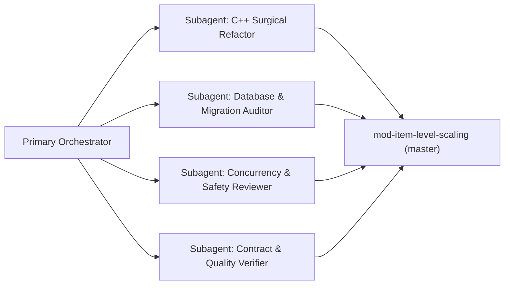

# Implementation Plan: Pure Live Generation Architecture (Master Default) - Reviewed and Extended Copy

> **Final reviewed implementation plan:** This final copy incorporates the accepted review verdict and the implementation boundary in Section 14. It extends `no_ledger_live_scaling_plan_reviewed.md` without removing any of its text or earlier sections. Planning is complete; implementation and its compile/runtime evidence remain pending. No further architectural planning round is required before implementation-start checks. The original and reviewed files remain preserved beside this final copy.

> **Review date:** 2026-10-04. This copy preserves the original plan structure and architecture decisions, corrects claims against the local source, and adds implementation and acceptance requirements. The original `no_ledger_live_scaling_plan.md` remains unchanged. This is a planning deliverable; implementation, database execution, deployment, and commits are separate work. See Sections 8-13 for evidence, failure handling, capacity, rollout, and verification details.

## Executive Summary

This plan governs the transition of the primary repository:
`C:\Users\Admin\AntigravityProfiles\Projects Azerothcore\Azerothcore modules\mod-item-level-scaling` (branch: `master`)

to become the **authoritative, pure live-scaling module without the legacy Demand Ledger**. A separate demand-ledger reference checkout exists at the following location; its backup completeness and deployment suitability must be verified before using it for rollback:
`C:\Users\Admin\AntigravityProfiles\Projects Azerothcore\Azerothcore modules\mod-item-level-scaling - Demand-Ledger`

The updated module operates on **Pure Live Generation (Hybrid Mode 1: bounded world-update prewarm + on-demand asynchronous variant creation)**. Generated templates are committed first to the live staging tables; `scaled_item_variant` stores permanent mappings, while `item_template` stores permanent template values after startup promotion. Ready cache hits use average $O(1)$ in-memory lookup without a database round-trip. A miss can defer loot until asynchronous commit acknowledgement and safe publication, or release the original loot on failure, timeout, or capacity exhaustion. Startup still performs synchronous schema validation, snapshot recovery, slot reservation, and core loading; no zero-latency or zero-restart-time guarantee is made.

> [!IMPORTANT]
> **Architectural Decisions & Scope Bounds**:
> - **Retain Hybrid Mode 1**: Hybrid Mode 1 (bounded world-update prewarm + on-demand live fallback) remains the authoritative default. The proposal to demote or replace Mode 1 with Mode 2 is rejected.
> - **Preserve Committed Key Collision Guard**: `_requestedKeys` is NOT deleted; it is renamed to `_committedKeys` and becomes read-only after initialization and prevents regeneration of keys already present in the permanent mapping table, including withheld records. It prevents that known duplicate-key recovery path; it does not replace SQL uniqueness, ownership validation, or recovery failure handling.
> - **Two-Tier Cache Hierarchy**: `ItemScalingRegistry::_keyToEntry` remains the strictly immutable registry of startup-loaded permanent variants. Current-session live variants are managed inside `ItemScalingLive::_impl->requests`. Live generation does NOT write into `_keyToEntry`.
> - **Accurate Threading & Concurrency Model**: Prewarming runs on the world thread after map workers have joined, with no synchronous gameplay DB I/O. `LiveMaxPublishPerTick` separately limits generation, publication, and current preview attempts; skipped catalogue entries and other update bookkeeping need additional accounting before the whole update can be described as bounded. Startup registry reads require no registry mutex after release/acquire publication; live request/cache operations remain synchronized via `_impl->mutex`.
> - **Full Materializer Dead-Code Elimination**: All startup ledger materialization helpers (`BuildItemTemplateInsertSQL`, `BaseColumns`, `ReadBaseTemplate`, `KeyPredicate`, `DeleteRequest`, `DeleteCompletedRequest`, `VariantInsert`, `CommitBatch`, and `MaterializePendingRequests`) are completely removed.
> - **Historical Migration Immutability**: Historical migrations `2026_09_27_00_item_scaling_initial_schema.sql` and `2026_10_04_00_item_scaling_live.sql` remain intact. The ledger table is safely retired via a new idempotent migration `2026_10_05_00_retire_demand_ledger.sql`.
> - **Issue Tracker Allocation**: Proposed next issue ID **`[MILS-013]`** in `docs/ISSUES.md`; it is not yet allocated by this document. Recheck for an existing or newly allocated record before implementation, then register the local record in `../COMMANDER/ISSUES.md` with an accurate pending status.

---

## 1. Operational Lifecycle Timeline: How the Module Runs

```mermaid
sequenceDiagram
    autonumber
    participant MySQL as MySQL Database
    participant Core as AzerothCore Engine
    participant Reg as ItemScaling Registry (RAM)
    participant Live as ItemScaling Live Engine
    participant Player as Player Client

    Note over MySQL, Reg: Stage 1: Server Boot & Pre-Allocation
    Core->>Reg: OnLoadCustomDatabaseTable()
    Reg->>MySQL: EnsureSchema() & ValidateSchema() (Validates scaled_item_variant only)
    Reg->>MySQL: RecoverStagedTemplates() (Promotes staged snapshots -> scaled_item_variant)
    Reg->>MySQL: ResolveSyntheticEntryRange() (Finds safe synthetic ID offset e.g. 500000+)
    Reg->>MySQL: ReserveSlots() (Inserts 'ItemScaling reserved' placeholders into item_template)
    Note over Reg: _dbSynchronized = true (Strictly after ReserveSlots succeeds)
    Core->>MySQL: ObjectMgr::LoadItemTemplates() (Loads all items + reserved slots into RAM)
    Core->>Reg: Initialize() (Loads scaled_item_variant into fast RAM _keyToEntry and _committedKeys)

    Note over Live, Player: Stage 2: Dungeon Entry & Bounded Prewarm (Hybrid Mode 1)
    Player->>Live: EnterMap() (Party enters instance)
    Live->>Live: Update() -> Prewarm() (Walks startup-loaded creature/chest catalogue and queues missing exact keys)

    Note over Live, Player: Stage 3: Live Gameplay & Item Drop
    Player->>Core: Kills Boss / Opens Chest
    Core->>Live: OnAfterLootTemplateProcess() / PrepareLoot() -> Calculate Target Level + Variance (±1, ±2, ±3)
    alt Permanent Cache Hit (Registry _keyToEntry)
        Live-->>Player: Swap Item ID -> Instant Scaled Loot (average O(1) in-memory lookup)
    else Live Session Hit (ItemScalingLive _impl->requests)
        Live-->>Player: Ready in Live Cache -> Swap Item ID (average O(1) in-memory lookup)
    else Existing Pending or Durable Live Request
        Live->>Player: Track/defer eligible loot; reuse the request and reserved ID
    else Existing Failed Live Request
        Live-->>Player: Preserve original loot; no session slot reuse
    else Committed Collision Guard (_committedKeys check)
        Live-->>Player: Key already owned in SQL but invalid -> Drop Original (Prevents Duplicate Key Error)
    else Cache Miss (Unseen Item/Level)
        Live->>Live: Reserve slot, copy base template and enqueue exact key
        Live->>Player: Defer loot opening; retain original rolled loot
        Note over Live, Core: Bounded generation in a later world update
        Live->>Live: Compute scaled template and serialize full snapshot
        Live->>MySQL: AsyncCommitTransaction() (Non-blocking snapshot to staged tables)
        Live->>Player: Defer CMSG_ITEM_QUERY_SINGLE (Packet Suppression)
        Note over Live, Core: Commit acknowledged in a later Update; publish after map workers join
        Live->>Core: Copy into existing reserved template at the world-update barrier
        Live->>Live: Set request.state = Ready in _impl->requests
        Live->>Player: Replace intact deferred loot; requeue normal loot/query handling, otherwise keep original
    end
```

### Detailed Breakdown of Execution Stages

#### Stage 1: Server Boot & Pre-Allocation (`OnLoadCustomDatabaseTable` & `Initialize`)
1. **Schema Check (`EnsureSchema` & `ValidateSchema`)**:
   - Ensures `scaled_item_variant` and live tables exist. Validate InnoDB for every table in live transactions and matching canonical/staging column layouts. `CREATE TABLE ... LIKE` inherits each canonical schema; do not assume all core tables use the slot table's `utf8mb4_unicode_ci` collation.
   - The registry validates the two canonical persistence tables (`item_template` and `scaled_item_variant`); live recovery separately validates all five transaction participants, including `mod_item_level_scaling_slot`, `mod_item_level_scaling_staged_item`, and `mod_item_level_scaling_staged_variant`.
2. **Promote Staged Snapshots (`RecoverStagedTemplates`)**:
   - If the server previously crashed or rebooted while live items were being generated, this promotion executes:
     ```sql
     -- Schematic only: validate schema, ownership and matching payloads first.
     START TRANSACTION;
     DELETE i FROM item_template i
       JOIN mod_item_level_scaling_slot p ON p.entry=i.entry
       JOIN mod_item_level_scaling_staged_item s ON s.entry=i.entry
       WHERE p.assigned=1 AND i.name='ItemScaling reserved';
     INSERT INTO item_template SELECT * FROM mod_item_level_scaling_staged_item;
     INSERT INTO scaled_item_variant SELECT * FROM mod_item_level_scaling_staged_variant;
     DELETE p FROM mod_item_level_scaling_slot p
       JOIN mod_item_level_scaling_staged_variant v ON v.variant_entry=p.entry;
     DELETE FROM mod_item_level_scaling_staged_item;
     DELETE FROM mod_item_level_scaling_staged_variant;
     COMMIT;
     -- Verify postconditions: DirectCommitTransaction itself returns no success flag.
     ```
   - **Durable issued-ID preservation**: Complete committed snapshots are promoted with their original IDs and values. SQL/schema/ownership conflicts retain the payloads and stop startup before login. This depends on acknowledged commits, MySQL durability, and consistent backups; incomplete or uncommitted requests do not justify awarding synthetic IDs.
3. **Synthetic Entry Allocation (`ResolveSyntheticEntryRange`)**:
   - Preserves collision-safe allocation above existing item IDs, permanent variant IDs and slot ownership. The current registry diagnostic uses `_nextSyntheticEntry`, while the live allocator in `ReserveSlots()` independently uses `ItemScalingSafety::AllocationStart` and the slot table. After materializer removal, either retain the registry range check deliberately or consolidate that now-unused allocator state into the live allocator without weakening overflow/cap checks.
4. **Pre-Allocating Placeholder Slots (`ReserveSlots`)**:
   - Pre-creates empty placeholder items in `item_template` (`name = 'ItemScaling reserved'`) and registers them in `mod_item_level_scaling_slot`.
   - **Why this is critical**: The inspected core exposes a `std::vector<ItemTemplate*> const*` indexed by item ID. Startup placeholders populate both native lookup containers and establish stable mutable pointees before gameplay. Runtime publication copies into an existing unused object without resizing the vector, inserting entries, or replacing pointers; all readers must respect the publication barrier.
5. **Strict Synchronization Ordering**:
   - `_dbSynchronized` is set to `true` **only after** `ReserveSlots()` successfully completes:
     ```cpp
     if (!sItemScalingLive->ReserveSlots())
     {
         LOG_ERROR("module.ItemScaling", "Could not reserve live slots; stopping startup before player login.");
         _dbSynchronized = false;
         World::StopNow(ERROR_EXIT_CODE);
         return;
     }
     _dbSynchronized = true;
     ```
6. **Core Template Load (`ObjectMgr::LoadItemTemplates`)**:
   - AzerothCore loads `item_template` into its native item stores, including the pointer vector (`ItemTemplateStoreFast`), including native items, previously scaled variants, and pre-reserved placeholder slots.
7. **Fast RAM Indexing & Collision Guard (`Initialize`)**:
   - Reads every existing scaled item from `scaled_item_variant`.
   - Inserts every committed key into `_committedKeys` (both valid and invalid templates).
   - Inserts valid templates from the active formula/generator/preservation family into `_keyToEntry`; other issued families remain stored and usable by their existing IDs:
     $$\text{VariantKey}(\text{baseEntry, targetEffectiveLevel, targetItemLevel, formulaVersion, generatorRevision, requiredLevel, randomPropertyId}) \longrightarrow \text{variantEntry}$$
   - Publishes `_initialized.store(true, std::memory_order_release)` after all registry and baseline construction; gameplay entry points read it with `std::memory_order_acquire`. From this point onward, `_committedKeys` and `_keyToEntry` are **strictly read-only (immutable)**.
   - **Result**: In-game lookups for permanent variants provide **average $O(1)$ in-memory lookups with no database round-trip** and no registry mutex. Live-session lookup still takes the live mutex.

---

#### Stage 2: Dungeon Entry & Bounded Prewarm (`EnterMap` / Hybrid Mode 1)
1. **Dynamic Target Level Resolution**:
   - Uses the existing shared target resolver: highest eligible real-player level, dynamic/fixed policy, effective creature level or configured reference, category floor/ceiling and weighted variance, brackets, and required-level policy. A creature template used by prewarm can differ from the actual current creature level or rolled variance; live fallback remains required.
2. **Bounded World-Update Prewarm (`ItemScalingLive::Impl::Prewarm`)**:
   - Executes strictly on the **world thread** during `ItemScalingLive::Update()`, after `MapMgr::Update` has joined all map worker threads.
   - Walks a catalogue loaded once during startup from dungeon creature loot (including difficulty variants), chests, reference graphs, and optional enchantment pools. It does not query loot tables during map entry or prewarm. Charge skipped items, empty sources, and visited instances against work budgets as well as successful preview attempts; Section 10 records gaps in the current loop.
   - For each eligible catalogue candidate, checks if a scaled version already exists in permanent registry `_keyToEntry` or live cache `_impl->requests`.
   - If missing, enqueues non-blocking live generation ahead of time without blocking the world loop or executing synchronous DB I/O.

---

#### Stage 3: Item Drop & Live Asynchronous Generation
When native loot processing reaches `OnAfterLootTemplateProcess` / `PrepareLoot`, or an eligible chest reaches `PrepareChest`:

```text
[Creature Dies / Chest Opened]
               │
               ▼
1. Calculate Target Level & Apply Dynamic Variance (±1, ±2, ±3)
               │
               ▼
2. Check PreserveNativeLoot:
   Does its native reference match requested target, bracketed target, or eligible player level?
       ├── YES ──> Drop Original Blizzard Item (0 SQL, 0 RAM overhead)
       └── NO  ──> Proceed to Scaling
               │
               ▼
3. Check Permanent RAM Registry (_keyToEntry):
   Does a permanent variant exist?
       ├── YES ──> Swap loot item ID directly (average O(1) in-memory lookup)
       └── NO  ──> Check Live Session Cache
               │
               ▼
4. Check Live Session Cache (ItemScalingLive::_impl->requests):
   Is a live variant already Ready?
       ├── YES ──> Swap loot item ID directly (average O(1) in-memory lookup)
       └── NO  ──> Existing Pending/Durable: defer; Failed: preserve original; otherwise check guard
               │
               ▼
5. Check Committed Collision Guard (_committedKeys):
   Is this key already owned in SQL (even if corrupt/skipped)?
       ├── YES ──> Return 0 / Preserve Original (Prevents Duplicate Key Error 1062)
       └── NO  ──> Proceed to Live Generation
               │
               ▼
6. Trigger Live Generation (Consume Reserved Slot -> Compute -> Async Snapshot -> Publish)
```

**What Happens on a Cache Miss (Live Generation)?**
1. **Slot Allocation and Deduplication**:
   - The engine pops one pre-reserved entry ID from the `slots` queue (e.g. ID `500124`) protected by `_impl->mutex`. It copies base-template values, inserts one `Pending` request per exact seven-field key, and queues generation work; the loot hook does not calculate or publish the template.
2. **Stat Calculation (`ItemScalingFormula::CreateScaledTemplate`)**:
   - In a bounded world-update generation phase, calculates the scaled template, including item level, armor, weapon damage and supported stats/random bonuses, and applies the key's required level. Preserve the formula's representability and metadata checks; unsupported baking falls back to original loot.
3. **Snapshot Creation (Persisting to SQL)**:
   - Serializes the exact generated template.
   - Dispatches a non-blocking asynchronous transaction:
     ```sql
     INSERT INTO mod_item_level_scaling_staged_item VALUES (...);
     INSERT INTO mod_item_level_scaling_staged_variant VALUES (...);
     UPDATE mod_item_level_scaling_slot SET assigned = 1
       WHERE entry = 500124 AND assigned = 0;
     ```
   - **No synchronous gameplay database wait**: SQL executes on database workers. Stat computation, snapshot serialization, queue operations, callbacks and publication still consume world-thread time and need bounded work plus measurements. Commit latency is variable; milliseconds are not guaranteed.
4. **Packet Suppression & Loot Deferral**:
   - The main wait is deferred loot opening (`CMSG_LOOT`) or chest activation before native group rolls. Item queries for reserved IDs are tracked by player GUID and entry, suppressed, then reconstructed/requeued after publication; the original packet object is not retained across ticks.
   - Suppresses placeholder responses so they cannot be cached as the issued item's metadata. Tooltip/icon rendering and cache behavior still require client acceptance checks.
5. **World Update Publication Barrier (`ItemScalingLive::Update`)**:
   - The world thread polls transaction futures without waiting, marks successful requests `Durable`, and copies them into unused reserved objects during an eligible publication phase after map workers join. This may take several ticks. The following assignment is an ordinary C++ copy protected by phase ordering, not a hardware-atomic operation:
     ```cpp
     *(*sObjectMgr->GetItemTemplateStoreFast())[entry] = scaledTemplate;
     ```
   - Sets `request.state = Impl::State::Ready` in `_impl->requests` (does NOT write to immutable registry `_keyToEntry`).
   - Replaces only intact deferred loot before active rolls, then requeues normal loot/query processing. Failed, expired, changed or cancelled sources preserve original loot.
   - A ready variant can be awarded in this run without restarting; client-visible tooltip/stat correctness remains a runtime acceptance requirement.

---

## 2. When Are Items Saved to SQL? Summary Matrix

| Event | Database Table Affected | Synchronous / Asynchronous | Purpose |
| :--- | :--- | :--- | :--- |
| **Server Startup** | `scaled_item_variant` & `item_template` | Synchronous (`DirectCommitTransaction`) | Promotes staged snapshots left over from previous runs so no items are lost. |
| **Server Startup** | `item_template` & `mod_item_level_scaling_slot` | Synchronous (`DirectCommitTransaction`) | Pre-allocates placeholder slot entries to size the memory vector safely. |
| **Item Drop / Cache Miss** | `mod_item_level_scaling_staged_item` & `mod_item_level_scaling_staged_variant` | **Asynchronous** (`AsyncCommitTransaction`) | Commits the full snapshot/mapping/slot assignment together; only acknowledged durable work can be published. No synchronous world-thread DB wait or fixed commit latency. |
| **Next Server Restart** | `scaled_item_variant` & `item_template` | Synchronous (`DirectCommitTransaction`) | Automatically moves staged records into permanent tables. |

---

## 3. Inventory of Removals & Surgical Edits

### A. Database Layer
1. **Current Base Schemas**:
   - Remove `CREATE TABLE IF NOT EXISTS scaled_item_variant_request` from `data/sql/db-world/base/scaled_item_variant.sql` and `sql/world/base/scaled_item_variant.sql`.
2. **Historical Migrations Preserved Intact**:
   - Keep `data/sql/db-world/updates/2026_09_27_00_item_scaling_initial_schema.sql` and `2026_10_04_00_item_scaling_live.sql` unchanged. A fresh base plus historical updater can temporarily recreate the ledger; ordered execution of the new retirement migration must leave the final schema ledger-free.
3. **Idempotent Retirement Migration**:
   - Add new migration `data/sql/db-world/updates/2026_10_05_00_retire_demand_ledger.sql`:
     ```sql
     -- Safely retire legacy demand ledger table
     DROP TABLE IF EXISTS `scaled_item_variant_request`;
     ```
4. **Explicit Ledger Data Retirement Consequence**:
   - Document clearly: rows in `scaled_item_variant_request` represent pending, unmaterialized requests only (not player-owned items). Discarding them cancels outstanding requests for future generation; existing permanent or staged issued items remain protected. Capture their count and retain a pre-migration export before retirement, with old writers stopped.
   - Before applying the migration, first check table existence through `information_schema.TABLES`, then report `SELECT COUNT(*) FROM scaled_item_variant_request;` if present. A fresh install or repeated run must not fail because the table is already absent. `DROP TABLE` is not undone by a user transaction; see Section 11.
   - Live staging tables (`mod_item_level_scaling_staged_*`) and slots (`mod_item_level_scaling_slot`) are strictly retained.
5. **SQL Readme Update**:
   - Update `data/sql/db-world/mod_item_level_scaling_readme.sql` to describe the pure live generation architecture and remove references to startup demand materialization.

### B. Registry & Collision Guard Refactoring (`ItemScalingRegistry.*`)
1. **Retain and Rename `_requestedKeys` $\rightarrow$ `_committedKeys`**:
   - Do NOT delete this set.
   - Rename to `std::unordered_set<VariantKey, VariantKeyHash> _committedKeys;`.
   - Populated during `Initialize()` with all rows from `scaled_item_variant` (including invalid ones).
   - In `FindOrRequestVariant()`: check `if (_committedKeys.count(key)) return 0;`. This guarantees that if a key was committed to SQL but marked invalid, generation through the registry will not stage a second synthetic ID for it. Keep all runtime generation callers routed through this guard; live request deduplication independently handles same-session races. SQL recovery collisions still require fail-closed handling.
2. **Remove `_requestMutex`**:
   - `_committedKeys` and `_keyToEntry` are constructed at startup and become strictly read-only after `_initialized = true`.
   - Because there are zero post-initialization writes to these sets in the registry, concurrent reads need no registry mutex, provided every caller observes initialization and no writer or reinitialization remains. This is an immutable-container design, not a claim about the standard library providing lock-free algorithms.
3. **Complete Dead-Code Removal (Materializer Sweep)**:
   - Remove `MaterializePendingRequests()`.
   - Remove `QueueVariantRequest()`.
   - Remove `KeyPredicate()`, `DeleteRequest()`, `DeleteCompletedRequest()`, `VariantInsert()`, and `CommitBatch()`.
   - Remove `BuildItemTemplateInsertSQL()`, `BaseColumns`, and `ReadBaseTemplate()`.
   - Remove includes and helpers only after checking remaining uses. Preserve `ReadKey`, `ValidKey`, `KeyColumns`, `IdentityColumns`, `ReadIdentity`, family validation, curve loading, synthetic/baseline exclusions and identity checks used by live generation or initialization. Review `_nextSyntheticEntry` and `ResolveSyntheticEntryRange()` as described in Stage 1.
4. **Startup Schema Verification**:
   - In `EnsureSchema()`: Remove table creation, column migrations, and primary key logic for `scaled_item_variant_request`.
   - In `ValidateSchema()`: Remove loop iteration for `scaled_item_variant_request`; verify InnoDB status for 2 tables (`item_template`, `scaled_item_variant`).
5. **Synchronous Boot Ordering**:
   - In `OnLoadCustomDatabaseTable()`: Set `_dbSynchronized = true` only after `ReserveSlots()` succeeds.
6. **Stale Header Comments Cleanup**:
   - In `src/ItemScalingLive.h`:
     Update comment on `ReserveSlots()`:
     ```cpp
     bool ReserveSlots(); // startup, pre-allocates live generation template slots
     ```
   - In `src/ItemScalingRegistry.h`:
     Update comment on `FindOrRequestVariant()`:
     ```cpp
     // Hits select immutable templates; misses invoke live generation.
     ```

### C. Configuration Layer (`ItemScalingConfig.*` & `conf/`)
1. **Remove Dead Settings**:
   - Remove `ItemScaling.DemandLedger.Enable` from `conf/mod_item_level_scaling.conf.dist`.
   - Remove `ItemScaling.MaxNewVariantsPerStartup` from `conf/mod_item_level_scaling.conf.dist`.
2. **Update Config Struct & Loader**:
   - In `ItemScalingConfig.h`: Remove `bool DemandLedgerEnable` and `uint32 MaxNewVariantsPerStartup`.
   - In `ItemScalingConfig.cpp`: Remove option reading and invariant assertions for `DemandLedgerEnable`.
3. **Update Semantics for `ItemScaling.Live.Enable`**:
   - Keep `ItemScaling.Live.Enable = 1` as default.
   - Document new semantics:
     - `Live.Enable = 1`: Pure Live Generation active (Hybrid Mode 1 bounded prewarm + on-demand async generation).
     - `Live.Enable = 0`: **Persisted-variants-only mode**. Serves existing variants already in `scaled_item_variant`; unseen variants remain original Blizzard items with zero generation or queueing.

### D. Loot & Script Layer (`ItemScalingLootScript.cpp`)
1. **Clean Code & Comments**:
   - Update comments to reflect live generation and remove references to legacy demand queueing. Also update `src/ItemScalingCommands.cpp`: inspection currently promises generation on the next restart in legacy mode. Persisted-only misses must report that generation is disabled, and status must distinguish permanent indexed, live pending/durable/ready, and unavailable variants.

---

## 4. Multi-Agent Execution Strategy

If the later implementation task authorizes delegation, these roles provide clear edit and verification boundaries. Delegation is optional for this plan review. Use only agents available in the active session; do not hard-code model aliases. With four total concurrency slots, the lead can run at most three child agents at once, so the four roles below must be scheduled in waves or combined:



### Agent Roles & Delegated Responsibilities:
1. **Lead Orchestrator (Current Agent)**:
   - Directs the workflow, sequences edits, reviews intermediate diffs, and synthesizes reports.
2. **Subagent 1: C++ Surgical Refactor (available coding agent)**:
   - Applies the surgical removals to `ItemScalingConfig`, `ItemScalingRegistry`, `ItemScalingLive`, and `ItemScalingLootScript`.
   - Implements `_committedKeys` immutable, synchronization-free registry lookup and eliminates dead materializer methods (`MaterializePendingRequests`, `BuildItemTemplateInsertSQL`, `BaseColumns`, `CommitBatch`, etc.).
   - Updates comments in `ItemScalingLive.h` and `ItemScalingRegistry.h`.
3. **Subagent 2: Database Migration Auditor (available audit agent)**:
   - Cleans base SQL schemas and creates `2026_10_05_00_retire_demand_ledger.sql`.
   - Updates `mod_item_level_scaling_readme.sql`.
   - Verifies MySQL syntax, InnoDB constraints, and idempotency guards.
4. **Subagent 3: Concurrency & Safety Reviewer (available review agent)**:
   - Audits all altered code paths for world-thread safety: verifies per-phase and skipped-work budgets after map workers join, verifies release/acquire publication and read-only `_committedKeys`, and validates packet suppression logic.
5. **Subagent 4: Contract & Quality Verifier (available audit agent)**:
   - Updates and runs `tests/check_source.py` and `tests/check_sql.py`.
   - Executes 3-state SQL upgrade compatibility verification.
   - Validates maintainer skill (`quick_validate.py`).

---

## 5. Phased Implementation Sequence for `mod-item-level-scaling`

### Phase 1: Environment Inspection
- Target Directory: `C:\Users\Admin\AntigravityProfiles\Projects Azerothcore\Azerothcore modules\mod-item-level-scaling`
- Record branch, commit and pre-existing changes before editing. The review found branch `master` with two user-owned untracked plan files; preserve them and any later changes. A dirty working tree is not grounds for reset or removal. Use the user-approved branch/worktree for later implementation; this document does not authorize committing or deployment.

### Phase 2: Configuration & Config Script Refactoring
- **`conf/mod_item_level_scaling.conf.dist`**: Remove `ItemScaling.DemandLedger.Enable` and `ItemScaling.MaxNewVariantsPerStartup`. Document `Live.Enable = 0` as persisted-only mode.
- **`src/ItemScalingConfig.h`**: Remove `DemandLedgerEnable` and `MaxNewVariantsPerStartup`.
- **`src/ItemScalingConfig.cpp`**: Remove option loading and invariant assertions.

### Phase 3: Registry & Schema Refactoring
- **`src/ItemScalingRegistry.h`**:
  - Rename `_requestedKeys` $\rightarrow$ `_committedKeys`.
  - Remove `_requestMutex`.
  - Remove `MaterializePendingRequests()` and `QueueVariantRequest(...)`.
  - Update comment on `FindOrRequestVariant()`.
- **`src/ItemScalingRegistry.cpp`**:
  - Remove `EnsureSchema()` logic for `scaled_item_variant_request`.
  - Update `ValidateSchema()` to check only `scaled_item_variant` and reduce InnoDB table count check to 2.
  - Remove complete materializer block: `BuildItemTemplateInsertSQL`, `BaseColumns`, `ReadBaseTemplate`, `KeyPredicate`, `DeleteRequest`, `DeleteCompletedRequest`, `VariantInsert`, `CommitBatch`, and `MaterializePendingRequests`.
  - In `OnLoadCustomDatabaseTable()`: Set `_dbSynchronized = true` only after `ReserveSlots()` succeeds.
  - In `Initialize()`: Populate `_committedKeys` with all committed rows.
  - In `FindOrRequestVariant()`: Read `_committedKeys` after initialization without a registry mutex; on an unowned eligible miss, invoke `sItemScalingLive->FindOrRequest(...)`.
- **`src/ItemScalingLive.h`**:
  - Update comment on `ReserveSlots()`.
- **`src/ItemScalingLive.cpp`**:
  - Preserve recovery, slot ownership, async commits, request state transitions and the publication barrier. Apply the required budget accounting in Section 10; distinguish any larger scheduling improvement from ledger removal.
- **`src/ItemScalingCommands.cpp`**:
  - Correct persisted-only inspection/status text and preserve visibility of current-session live variants.

### Phase 4: Database Scripts & Migration Cleanliness
- **`data/sql/db-world/base/scaled_item_variant.sql` & `sql/world/base/scaled_item_variant.sql`**: Remove `scaled_item_variant_request` table definitions.
- **`data/sql/db-world/updates/2026_10_05_00_retire_demand_ledger.sql`**: Add idempotent `DROP TABLE IF EXISTS scaled_item_variant_request;`.
- **`data/sql/db-world/mod_item_level_scaling_readme.sql`**: Update architecture documentation to pure live generation.

### Phase 5: Test Suite & Tooling Modernization
- **`tests/check_source.py`**: Add negative assertion verifying `scaled_item_variant_request`, `DemandLedger`, and `MaterializePendingRequests` do NOT appear in active `src/`, `conf/`, or base schemas (excluding historical migration files).
- **`tests/check_sql.py`**: Rewrite the existing dependency on deleted materializer helpers and byte-identical base/history DDL. Compare final schemas after ordered migrations, extract surviving live SQL and preserve complete snapshot, restart and rollback coverage. Run the three-state compatibility matrix against disposable MySQL.
- **`tests/README.md`**: Replace legacy-mode and materializer expectations with persisted-only and live recovery checks; distinguish historical test results from this refactor's results.
- **`tests/check_compile.py` and `tests/test_*.cpp`**: Inspect for removed API/fixture dependencies; update only affected contracts. Compilation remains a separate authorized check.

### Phase 6: Documentation, Tracker & Skill Updates
- **`README.md`**: Remove the active legacy demand-ledger section. Document pure live hybrid generation, staging versus permanent storage, startup costs, capacity limits, persisted-only mode, and migration ordering. Preserve historical issue evidence.
- **`AGENTS.md`**: Update rule 1.D: replace "demand ledgers" with "idempotent live SQL persistence".
- **`docs/ARCHITECTURE.md`**: Update architecture diagrams and data flow to show pure live generation pipeline.
- **`docs/ISSUES.md`**: Recheck the proposed **`[MILS-013]`** ID, then create/update the strict 9-point record with `IDENTIFIED / PENDING FIX` or the supported current status. Record completed checks and remaining runtime gates; do not predeclare resolution. Preserve **`[MILS-004]`** for outstanding first-run/client/runtime acceptance.
- **`docs/DEBUGGING.md`**, **`docs/ROADMAP.md`**, and **`tests/README.md`**: Sweep active guidance for stale ledger assumptions. Historical plans and issue evidence may retain clearly dated legacy terminology.
- **`../COMMANDER/ISSUES.md`** and **`../COMMANDER/README.md`**: During implementation, update the issue summary/link, module description and affected counts after the local tracker changes; keep detailed engineering records here.
- **`.agents/skills/item-level-scaling-maintainer/SKILL.md`**: Update maintainer skill invariants.

---

## 6. Verification & Quality Gates

Repository implementation checks and release/runtime acceptance are separate gates. The refactor may be prepared with static and disposable MySQL evidence, but full verification and issue resolution require the applicable compile/runtime checks in Section 12. This review alone satisfies none of those implementation gates:

- [ ] **Contract Audit (`tests/check_source.py`)**: Runs cleanly against the explicitly recorded core checkout, auditing source patterns for native field coverage, packet API hooks and publication ordering, plus negative assertions against legacy ledger symbols in active files.
- [ ] **Zero Active Orphan Search**: Search across `src/`, `conf/`, and base `.sql` confirms 0 active occurrences of `scaled_item_variant_request` and `ItemScaling.DemandLedger.Enable` (historical migration `2026_09_27_00_item_scaling_initial_schema.sql` excluded).
- [ ] **Three-State Database Upgrade Compatibility Matrix**:
  - **State A (Fresh Install)**: Base schema has no `scaled_item_variant_request`; final database has 0 occurrences.
  - **State B (Existing Install with Empty Request Table)**: Retirement migration drops it cleanly.
  - **State C (Existing Install with Pending Ledger Rows)**: Pre-migration count is reported, retirement migration drops the table, and live staging tables remain intact.
  - **Non-Interference Regression Assertion**: Retirement migration strictly does NOT drop or alter:
    `scaled_item_variant`, `item_template` synthetic variants, `mod_item_level_scaling_slot`, `mod_item_level_scaling_staged_item`, and `mod_item_level_scaling_staged_variant`.
- [ ] **MySQL Schema Idempotency**: Execute new migrations twice on disposable MySQL, verify final table/index/layout contracts, and record engine/version. Regex syntax checks alone are not SQL execution. Full restart/rollback checks must use the normal suite, not initialization-only mode.
- [ ] **Maintainer Skill Integrity**:
  ```bash
  python "C:\Users\Admin\.codex\skills\.system\skill-creator\scripts\quick_validate.py" ".agents/skills/item-level-scaling-maintainer"
  ```
- [ ] **Authoritative Issue Record**: `docs/ISSUES.md` updated with a complete technical record under the rechecked next free issue ID (proposed **`[MILS-013]`**), with accurate pending/passed gates.
- [ ] **Git Scope and User-Change Preservation**: Review the implementation diff and `git diff --check`, preserving pre-existing changes. Commit only when authorized, using the agreed branch; a clean tree or a commit is not evidence of runtime correctness.
- [ ] **Explicit Verification Notice**: Report each check actually run, its result, and unrun checks. If source and full MySQL checks pass but compilation/runtime are not run, say so explicitly and keep release/runtime acceptance pending. Avoid building or configuring worldserver without explicit authorization; avoiding a worldserver build alone does not prove that module compilation or isolated runtime checks are prohibited.

---

## 7. Review Deliverable and Subsequent Implementation

The current requested deliverable is this corrected, extended copy in the same folder. The review preserves Hybrid Mode 1, the permanent collision guard, immutable registry publication, durable staging, and historical migrations. Sections 8-13 make the implementation requirements concrete. A later request to implement this plan defines authorization for code changes, the branch/worktree, and verification/deployment scope; no additional confirmation is needed to finish this documentation review.

---

## 8. Source Evidence, Assumptions, and Required Corrections

### A. Review Baseline

The review used the module at commit `74424ce07b228daa247b3ad9509f9719b3932ff0` on `master` and the local server core at commit `06234df3d5ab26c93f4f1f06f3edb828b73ecd3c`, located at `../../Azerothcore server/azerothcore-wotlk`. These are inspection baselines, not a deployment or compatibility certification. Record actual source revisions again when implementation starts.

The original plan and `pure_live_scaling_plan.md` were already untracked before this review. Preserve both. This copy does not update source, SQL, configuration, trackers, or runtime files.

| Evidence | What the implementation must preserve or correct |
| :--- | :--- |
| [`VariantKey` in `src/ItemScalingCommon.h`](../../src/ItemScalingCommon.h) | Seven identity fields, including formula version and generator revision, participate in ordering, equality, hashing, staged mapping and permanent uniqueness. |
| [`ItemScalingRegistry::Initialize`](../../src/ItemScalingRegistry.cpp) | Reserve keys and IDs before template validation; index eligible active-family variants; exclude all permanent and reserved IDs from the baseline. Publish initialized state with release/acquire ordering. |
| [`FindOrRequest` and `Update`](../../src/ItemScalingLive.cpp) | Misses copy values and enqueue; update work computes and serializes; acknowledged transactions precede publication and selection. |
| [`RecoverStagedTemplates` and `ReserveSlots`](../../src/ItemScalingLive.cpp) | Validate five InnoDB tables and canonical/staging layouts; transactionally remove owned placeholders and completed reservations; check postconditions. |
| [`LoadCatalogue` and `Prewarm`](../../src/ItemScalingLive.cpp) | Creature/difficulty loot, reference graphs and chests are loaded at startup; gameplay traverses RAM. Several skip paths currently do not decrement the preview budget. |
| [`ResolveTargetLevels` and `PrepareLoot`](../../src/ItemScalingLootScript.cpp) | Preserve current creature-level policy, player eligibility, variance scope, category bounds, brackets, native-match bypass and loot exclusions. |
| [`ItemScalingConfig::Load`](../../src/ItemScalingConfig.cpp) | Every `Live.*` option is startup-only; remove demand options from reload comparisons and warning text as well as initial loading. |
| [`ItemScalingCommands.cpp`](../../src/ItemScalingCommands.cpp) | Inspection currently refers to next-restart legacy generation; correct that user-facing promise. |
| [`tests/check_sql.py`](../../tests/check_sql.py) | The suite extracts materializer helpers, compares historical/base CREATE definitions, and asserts demand persistence. Rewrite those dependencies. |
| [`tests/check_source.py`](../../tests/check_source.py) and [`tests/README.md`](../../tests/README.md) | Source contracts require `--core`; static checks do not exercise concurrency or player-visible behavior. Keep historical results dated and scoped. |

In the inspected core, `World::Update` runs `MapMgr::Update` before `OnWorldUpdate`; the map updater waits for workers, and `GetItemTemplateStoreFast` exposes a const container of mutable pointers. `AsyncCommitTransaction` enqueues database work; `TransactionCallback::InvokeIfReady` tests readiness without waiting. The DB worker completes the transaction result, and the module callback is polled and applied on the world thread. Revalidate these contracts if the target fork changes.

### B. Shared Helpers and Generation Families

- Preserve shared identity readers, validity checks, curve loading, baked-template validation, snapshot serialization and baseline exclusions adjacent to the removed ledger code.
- Keep `ItemScalingFormula::LoadStartupCurves` and the `PreserveNonZeroStats` family-conflict check in the enabled startup path.
- Keep generator revision `2` for a ledger-only refactor. A revision bump is justified when generated persisted values change, not by renaming, scheduling or ledger removal alone.
- Existing issued templates from older families remain usable by ID. Do not regenerate, renumber, rewrite or delete them to repair an invalid active lookup.
- Check that `_committedKeys` is populated before missing-template/invalid-row exits, is never written after initialized state is published, and guards every route to generation. Preserve the full registry read-count check; partial reads must not silently enable generation.
- Every public lookup or diagnostic reading startup containers must run after initialization or be gated appropriately. Removing the registry mutex requires zero concurrent writers, including reload/reinitialization paths.

---

## 9. Request State, Persistence, and Failure Contracts

### A. Exact State Transitions

```mermaid
stateDiagram-v2
    [*] --> Pending: Exact key accepted; one slot consumed
    Pending --> Durable: Full staging transaction acknowledged
    Pending --> Failed: Formula rejection or transaction failure
    Durable --> Ready: Owned placeholder copied at world barrier
    Durable --> Failed: Publication validation fails
    Ready --> Ready: Repeated key reuses immutable issued entry
```



`Pending` currently covers queued generation and in-flight SQL. A loot timeout or disconnect is a separate deferred-source event; it does not imply a failed transaction or permission to recycle that request's entry. A successful late commit may make the variant available to future drops while the already released loot stays unchanged.

1. **Concurrent same-key miss**: under the live mutex, one request consumes one reserved entry. Existing `Pending`/`Durable` requests attach eligible deferred loot, `Ready` returns the existing ID, and `Failed` preserves original loot without allocating another ID during this process.
2. **Atomic payload**: staged item, exact mapping, provenance and owned slot assignment belong to one transaction. A snapshot insert alone is insufficient durability evidence.
3. **Slot ownership**: a conditional assignment must match a known unassigned owned slot. SQL statement success alone does not prove an UPDATE matched a row. Document the single-writer invariant and test missing/already-assigned slot fixtures; strengthen the transaction if it can acknowledge payloads without their matching reservation.
4. **Durability before publication**: successful commit precedes `Durable`. Copy only into the expected unused placeholder; coordinate complete copy, `Ready` state and reserved-query suppression removal at the barrier.
5. **No recycling during uncertainty**: failed, rejected, durable-but-unpublished and in-flight entries remain unavailable for the session. At restart, reclaim only a validated unassigned placeholder with no committed payload. Promote complete committed snapshots instead.
6. **Recovery without regeneration**: use saved values and the original entry even after base stats or formula settings change. Validate payload pairing, identity, levels, ownership and schema before deleting placeholders. Do not use `INSERT IGNORE` or `REPLACE` to conceal conflicting issued IDs or keys.
7. **Postconditions**: preserve explicit verification after `DirectCommitTransaction`, which returns no success flag. A second recovery is a no-op; a genuine collision rolls back and retains staging/placeholder evidence.
8. **Disabled startup safety**: recover staged issued items when `ItemScaling.Enable=0` or `Live.Enable=0`. Validate existing reservations even without allocating new slots. Recovery failure stops startup before login in every mode.

### B. Failure and Race Acceptance Matrix

| Condition | Required result | Evidence |
| :--- | :--- | :--- |
| Permanent key has a missing/invalid template | Reserve key and ID; withhold selection; no second staging request | Guard/fixture and warning |
| Many workers request one key | One request, entry and snapshot transaction | Runtime counters and SQL uniqueness |
| Formula/random baking is unsupported | Original entry and rolled bonuses remain; no synthetic award | Fixed/random item cases |
| Queue full or slots exhausted | Ready hits still work; unseen loot stays original; no ledger fallback | Capacity fixture and diagnostics |
| Transaction fails or exhausts DB-worker retries | No `Ready` publication; original loot released; slot not reused | Forced rollback and loot handling |
| Timeout precedes SQL completion | Release original once; late commit affects future selection only | DB delay and unchanged released fingerprint |
| SQL commits, then process stops before publication | Next startup promotes the same ID and values | Restart/crash-boundary check |
| Placeholder changed unexpectedly | Withhold publication; preserve durable payload and report conflict | Ownership validation |
| Incomplete payload or schema-layout mismatch | Retain evidence and stop before login | Corrupt recovery fixtures |
| New loot generation, despawn, reset, logout or map change | Cancel/revalidate; no stale write, repeated award or active-roll rewrite | GUID/source-generation/runtime cases |
| Reserved item query times out | Suppress placeholder response; expire bookkeeping; no unpublished award | Packet/client-cache checks |
| Generation disabled after issued gear exists | Startup still recovers gear; owned items remain valid | Disabled restart/inventory checks |

Cross-tick references must be GUID/map/instance values and copied data. Resolve entities freshly before acting, retaining entry/index/count/random-property/suffix fingerprints and `LOOT_NONE` checks.

Commit acknowledgement depends on the database's durability configuration. Record `innodb_flush_log_at_trx_commit`; settings `0` and `2` can lose acknowledged transactions on a crash. If binary logging is used for recovery or replication, include its `sync_binlog` policy. Avoid an unconditional zero-item-loss claim. [MySQL durability settings](https://dev.mysql.com/doc/refman/8.4/en/innodb-parameters.html#sysvar_innodb_flush_log_at_trx_commit).

### C. Mode Compatibility Matrix

| Module setting | Generation mode | Existing eligible permanent variants | New requests | Startup recovery |
| :--- | :--- | :--- | :--- | :--- |
| `Enable=1`, `Live.Enable=1` | `GenerationMode=1` default | Select normally | Bounded prewarm plus actual-drop fallback | Required |
| `Enable=1`, `Live.Enable=1` | `GenerationMode=2` supported | Select normally | Actual-drop fallback only | Required |
| `Enable=1`, `Live.Enable=0` | Generation setting inactive | Select under existing eligibility/native rules | No generation, demand writes or unnecessary loot wait | Required |
| `Enable=0` | All generation inactive | Owned issued IDs remain valid; no new loot scaling | No generation | Required for issued staging |

Persisted-only mode requires restart because `Live.*` remains startup-only. A reload attempting to change it must warn and retain active values. Policy reloads must not clear requests, mutate issued templates or lose callbacks. Define how pending requests and deferred loot finish when `Enable` is toggled during a run; a flag change cannot be assumed to cancel in-flight SQL.

---

## 10. Bounded Work, Capacity, and Diagnostics

> **Final scope clarification:** Retain this section as the full analysis and acceptance reference. The ledger-removal patch includes the smallest directly necessary corrections to exposed unbounded loops and accurate budget documentation. Substantial changes to deferred scheduling, foreground headroom, queue fairness, configuration or metrics are separately justified follow-ups under Section 14, rather than implicit requirements to redesign `ItemScalingLive` in this patch.

### A. Required Budget Accounting

The current `Update()` separately limits generation, publication and prewarm with `LiveMaxPublishPerTick`. A value of `64` does not mean only 64 total operations. In `Prewarm`, missing templates, native-match skips and empty sources use `continue` without consuming preview budget. Callback polling and deferred source/query/visit processing also traverse retained collections. This is a source-observed gap, not a measured slowdown.

Before claiming bounded world-update work:

- Charge examined candidates/rolls and skipped items to a documented scan budget. Account for empty sources and visits without eligible owners; retain cursors across ticks.
- Preserve independent generation/publication limits. Document the existing setting as per-phase, or justify additional settings explicitly; do not silently redefine defaults.
- Bound deferred cleanup/resumption with fair cursors. Record how pending capacity limits callback traversal and measure its worst permitted cost; use incremental processing if needed.
- Continue expired/cancelled-action cleanup when disabled. Avoid repeated completed/empty scans and use fair iteration across instances.
- Check every reader that can overlap publication, including Playerbot gear/evaluation paths. A module mutex does not synchronize unrelated native readers of template fields.

A count budget bounds units, not elapsed milliseconds. Measure combined phase costs with representative metadata, random pools, instances, map workers and slow commits; report tick cost/backlog rather than promising zero lag.

### B. Slot Lifetime and Foreground Requests

- Preserve defaults of `4096` reserved slots and an independent `4096` pending cap unless a measured change is separately agreed. Each accepted distinct key consumes a session slot, including prewarm-only/ready variants and failures. The pending cap alone does not limit retained ready state.
- Replenishment occurs at startup, not runtime. After exhaustion, ready/permanent hits remain available and new misses preserve original loot until a later safe top-up within the ID ceiling.
- Prewarm can consume slots before actual drops. Define foreground preference through prewarm admission/headroom and work ordering without duplicating or reallocating accepted keys. Describe new queues/settings as an explicit scheduling improvement.
- Estimate capacity using the seven-field key: variance, required-level policy and baked properties multiply key count. Prewarm is best effort; actual creature levels or rolled variance can produce unseen keys.
- Keep `RandomSuffix.Mode=0` as default and bounded opt-in baking. Do not eagerly enumerate every possible level/property combination.
- Preserve 64-bit allocator arithmetic and ID caps. Pointer-vector RAM follows the highest entry, not just row count; avoid arbitrary huge offsets and never renumber issued IDs to save memory.
- Document one generating worldserver writer per world database. Independent generating realms sharing a DB need cross-process slot claiming/key deduplication; the startup in-memory guard alone is insufficient. Verify single-writer deployment or treat multi-writer support as separate work.

### C. Observable Outcomes

Keep `.itemscaling status` and inspection useful. Distinguish permanent indexed count, free slots, queued/in-flight work, durable/ready states, invalid committed-key suppression, capacity fallback, formula rejection, DB failure, publication conflict and timeout. Extend aggregate diagnostics only where needed to identify these outcomes.

Use rate-limited logs and aggregate counters. Capture commit latency, queue age and per-phase cost during acceptance. Correct persisted-only command wording and distinguish availability from generation activity; ready live hits do not await a restart.

---

## 11. Migration Ordering, Rollout, and Recovery

### A. Installation Paths and Final Schema

Validate ordered paths against actual module updater discovery:

1. **Fresh assembly**: core world schema → module base → all applicable module updates, including historical initial/live schemas → retirement migration.
2. **Module installation on ordinary world data**: historical initial module migration → live migration → retirement migration.
3. **Existing ledger/live install**: preserve permanent/staged/reserved rows → missing prerequisite updates → retirement migration.
4. **Repeated updater/startup**: ledger stays absent; runtime schema helpers do not recreate it; permanent/live data remain unchanged.

Both module bases must agree. Historical initial DDL still contains the old ledger; replace raw base/history equality assertions with comparisons of final schemas after ordered updates, including seven-column uniqueness and all five live persistence tables.

`2026_10_05_00_retire_demand_ledger.sql` is the original proposed filename, dated after this review. Recheck date, uniqueness and updater ordering when implementing; preserve already distributed migration contents.

### B. Pre-Migration Evidence

Prepare/review the retirement script before any active-realm execution. During authorized rollout, stop old ledger writers before final count/export. Record DB identity/version and source/binary revision, and check presence:

```sql
SELECT TABLE_NAME, ENGINE
FROM information_schema.TABLES
WHERE TABLE_SCHEMA=DATABASE()
  AND TABLE_NAME IN (
    'scaled_item_variant_request', 'scaled_item_variant', 'item_template',
    'mod_item_level_scaling_slot', 'mod_item_level_scaling_staged_item',
    'mod_item_level_scaling_staged_variant'
  );

-- Run only when the existence query reports the ledger.
SELECT COUNT(*) AS pending_ledger_rows FROM scaled_item_variant_request;
```

Retain a ledger schema/data export documenting cancelled requests and a consistent backup covering templates, permanent/staged mappings, slots and character-owned references. World/character backup points must be compatible so character IDs do not outlive their snapshots. Keep credentials out of reports.

The migration contains only the guarded ledger drop and comments. MySQL `DROP TABLE` implicitly commits and is not undone by a surrounding user transaction. Idempotency differs from reversibility; keep DDL retirement separate from transactional promotion. [MySQL implicit commits](https://dev.mysql.com/doc/refman/8.4/en/implicit-commit.html).

### C. Deployment and Rollback Boundaries

- Coordinate verified ledger-free code, migration and configuration. Running an old binary after retirement can recreate/use the ledger again.
- Runtime remains `../../Azerothcore server/Server/bin/`, with module config under `Server/bin/configs/modules/`. This review does not change/start/stop that runtime.
- Before opening the realm, verify layout compatibility, recovery completion, unchanged issued IDs/values, slot ownership, active mode and absence of ledger writes.
- Restart with `Live.Enable=0` as the documented generation fallback, retaining the new recovery code and owned gear. Disabling generation does not remove snapshots.
- Code rollback requires a version that understands current snapshots, families and schema. Verify the Demand-Ledger reference checkout before treating it as deployable.
- Restoring a ledger export may restore pending requests for a compatible older version; it does not justify restoring stale world persistence over newer character items. Never truncate variant/staging/slot/item tables as rollback.
- Recovery corruption retains evidence and stops startup until a specific consistent repair/restore is prepared. Do not delete offending rows merely to permit login.

---

## 12. Extended Verification and Completion Criteria

> **Final verification scope:** Apply these gates to the behavior changed or preserved by the ledger-removal patch. Retained scheduling and diagnostic recommendations do not require implementing a substantial follow-up before the ledger-removal patch can be prepared. Compile/runtime release gates still apply where required; deferring scheduler work is not evidence that unchanged paths are fully bounded or runtime-verified. Record deferred work and limitations explicitly under Section 14.

### A. Documentation-Only Review

Check section preservation, UTF-8, code fences, relative links, consistency and the unchanged original SHA-256. No module/server/database tests are needed solely for this copy, and this review does not satisfy implementation gates.

### B. Repository Implementation Gate

- [ ] Removal covers source, distributed config, both bases, command/reload text and active guidance. Historical migrations, dated plans/issues and the deliberate retirement DROP are explicit search exceptions.
- [ ] Same-key paths distinguish pending/durable/ready/failed; the committed guard precedes allocation, includes invalid rows and is immutable after initialization.
- [ ] Seven-field identity and full snapshot/provenance remain; no ledger-only generator bump, issued/base rewrite or ID renumbering.
- [ ] Startup curves/family checks, disabled recovery, schema/ownership checks and postconditions remain; synchronized/initialized flags cannot advertise partial success.
- [ ] Gameplay has no synchronous DB/file I/O or escaping; prewarm accounts for skipped work; deferred cleanup and combined costs have limits/evidence.
- [ ] Defaults/startup-only reload semantics remain; removed config keys/loaders are absent. Do not silently rewrite user/runtime config.
- [ ] Source-pattern assertions are reported as static evidence, not execution of initialization/publication/callback transitions.
- [ ] Documentation/tracker/catalog status agree; allocate the next free ID and leave runtime acceptance, including MILS-004, pending until verified.

From the module root:

```powershell
python tests/check_source.py --core '..\..\Azerothcore server\azerothcore-wotlk'
git diff --check
```

`git diff --check` excludes untracked files; inspect new files separately or include them in a review diff without committing. The skill validator has a documented pre-existing BOM issue: report the actual file's result accurately. If editing that skill, normalize deliberately and validate the edited file; a temporary copy does not prove the original passed.

### C. Disposable MySQL Gate

Use the supported Oracle MySQL version for SQL tests, recording its exact version and a private disposable DB. Require:

- [ ] Original install states A/B/C, both base/updater routes, ordered/repeated retirement and final absence via `information_schema`.
- [ ] Full before/after data comparisons across retirement for permanent/issued/staged/slot records, with non-empty staging and existing owned variants.
- [ ] Seven-column uniqueness and distinct formula/generator/required-level/property keys; signed widths and strict NULL rejection in surviving contracts.
- [ ] Surviving live SQL is exercised with updated extraction/bindings; no dependency on deleted materializer helpers.
- [ ] Complete staging survives DB restart; promotion preserves all serialized values/IDs even after base changes.
- [ ] Forced staging/mapping/ownership/promotion failures roll back without orphan payloads or overwritten custom/issued rows. Incomplete payload/assigned-slot/schema corruption is rejected.
- [ ] Repeated promotion is a no-op; invalid permanent mappings remain reserved; explicit remaining control-flow checks cover disabled startup.

After rewriting the suite, use `tests/check_sql.py --core <core-path> --mysqld <mysqld-path> --mysql <mysql-path>` with actual paths. Initialization-only mode cannot satisfy restart/expected-failure/rollback gates. A DB restart alone does not exercise a worldserver crash or loot deferral.

### D. Compilation and Runtime Release Gate

Do not configure/build worldserver without explicit authorization. For authorized module-only compilation, inspect the core/toolchain requirements before `tests/check_compile.py`; its GNU C++20 documentation differs from the maintainer's C++17 baseline. Report what actually compiled/executed, or leave those gates pending.

On an authorized isolated target-core/MySQL/Playerbot/client realm:

- [ ] Mode 1 prewarm plus unseen actual-drop fallback deliver a durable scaled item in the same run; Mode 2 remains supported.
- [ ] Concurrent same-key workers/players/bots share one ID; native queries and gear readers observe complete templates/stable pointers.
- [ ] Loot/bag/equip/inspect/chat-link metadata match saved values with clean/existing caches; reconnect/restart preserve IDs.
- [ ] Creature/chest ownership, locks/skills, loot conditions, quest exclusions and Need/Greed/group rolls remain valid; custom scripted/AI chests remain outside the adapter.
- [ ] Random skip/bake and variance/native-match/required-level policies preserve existing behavior, including unsupported bonuses.
- [ ] Delay/failure/timeout/saturation/exhaustion/prewarm pressure preserve original loot once; late commits do not rewrite released loot.
- [ ] Despawn/reset/logout/teleport/fresh loot generation cancel or revalidate; abandoned prepared chests have bounded cleanup without repeated rolling/awards.
- [ ] Boundaries before commit, after commit/before publication and after publication preserve persistence; disabled startup recovers snapshots.
- [ ] Multiple instances and near-capacity callbacks/deferred queues meet measured tick/work criteria.
- [ ] Trade/mail/auction/guild-bank and Playerbot valuation/equip resolve issued IDs. Startup autogear discovery can still await promotion and a later catalogue load; document that limitation.

Repository changes are **prepared** when applicable source and full disposable MySQL gates pass. Release acceptance remains **pending** until required compilation/runtime evidence exists. Report actual outcomes rather than inserting a predetermined all-checks-passed sentence.

---

## 13. Scope Discipline and Implementation Decision Checklist

> **Final decision boundary:** The allocator decision remains open until all remaining uses are searched during implementation. Foreground headroom, new queue structures and larger scheduling changes may be documented as separate follow-ups when substantial. Resolve only choices needed to implement the agreed patch safely; do not reopen the accepted architecture or silently expand the patch. Section 14 makes this boundary explicit.

Keep ledger removal reviewable while preserving the accepted architecture. Correctness requirements include the committed guard, code/setting removal, commands/docs/tests, migration ordering, disabled recovery and accurate budget accounting. Describe larger scheduling/metric/configuration changes separately with their rationale and evidence.

Before implementation, record these decisions without changing Mode 1's default:

1. **Allocator cleanup**: retain the now-diagnostic `_nextSyntheticEntry` check, or consolidate it into the live allocator and update dependent tests.
2. **Work limits**: define per-phase budget charging, skipped/deferred accounting and acceptable measured tick cost.
3. **Foreground headroom**: choose prewarm admission/ordering under pressure without duplicating keys or reallocating issued IDs.
4. **Slot ownership transaction**: verify a conditional assignment cannot acknowledge an incomplete ownership triple; strengthen if required.
5. **Migration/issue identity**: recheck filename ordering and next free issue ID before allocation.
6. **Evidence scope**: record authorized MySQL/toolchain/runtime checks and distinguish pending from passed throughout.

Keep the original beside this copy. Reconcile intervening source/config changes with the recorded baseline before using the reviewed plan for implementation.

---

## 14. Final Review Verdict and Binding Implementation Boundary

### A. Final Verdict

**Yes - call this the final reviewed implementation plan.** The plan is ready to guide implementation because it separates accepted architecture from implementation obligations and verification still requiring evidence. No further architectural planning round is necessary before starting the agreed work.

This verdict finalizes the plan, not the implementation. It does not declare ledger removal complete, allocate an issue ID, mark an issue resolved, or certify compilation/runtime behavior. The retained review and verification sections continue to state what must be implemented and demonstrated.

### B. Earlier Review Concerns Addressed in the Plan

| Concern | Final plan treatment |
| :--- | :--- |
| Permanent-key collision protection | Retain and rename `_requestedKeys` to `_committedKeys`; include withheld/invalid permanent keys so they cannot trigger another live allocation. |
| Startup versus session caches | Keep `_keyToEntry` immutable after initialization; store current-session variants and their mutable states in `ItemScalingLive::_impl->requests`. |
| Prewarm thread ownership | Describe it as world-thread work after map workers join, with budget accounting requirements rather than a background generator. |
| Historical SQL integrity | Preserve historical migrations and add an ordered, idempotent request-table retirement migration. |
| Disabled live generation | Define `Live.Enable=0` as persisted-only after restart, with no ledger fallback and preserved recovery of issued snapshots. |
| Cross-layer completeness | Include commands, tests, installation routes, documentation, issue ownership and COMMANDER catalog implications. |
| Upgrade coverage | Test fresh installation, an existing empty ledger and an existing pending ledger, preserving permanent/staged item data and slot state. |
| Verification distinctions | Separate source/static and full disposable MySQL evidence from compilation/runtime release acceptance. |
| Operational claims | Avoid unsupported promises of zero latency, mutex-free live processing or unconditional durability. |

These concerns are addressed as plan requirements. Their presence in this table does not assert that the corresponding code changes or checks have already been performed.

### C. Required Ledger-Removal Patch Versus Substantial Follow-Up

Enforce this boundary when selecting edits, tests and issue scope:

```text
Required for ledger-removal patch:
- remove ledger C++ path
- remove ledger config
- retire request table
- preserve live recovery/publication
- preserve committed-key guard
- fix affected tests/docs/commands
- correct any directly exposed unbounded loop necessary for the accepted invariant

Separate follow-up if substantial:
- new scheduling architecture
- new config knobs
- foreground/prewarm priority queues
- extensive diagnostics/metrics redesign
- generalized deferred-work scheduler
```

Section 10's prewarm scan budgeting, deferred cleanup scheduling, foreground headroom and queue fairness recommendations can become a performance refactor of `ItemScalingLive`. Preserve their analysis, but distinguish a small necessary fix from a larger redesign before editing. Existing required counters/command corrections can remain in the patch; an extensive observability redesign is a follow-up.

For a directly exposed unbounded loop, record the affected path, accepted invariant, minimal correction and focused regression evidence. Charge skipped catalogue work where needed while preserving cursors and existing defaults. Do not introduce a new scheduling architecture merely because the same loop could benefit from one.

Treat a change as substantial when it introduces queue classes/priority policies, a generalized work scheduler, new configuration semantics, or broad changes to unrelated live state transitions. Keep it in a separately scoped issue/task or patch with its own rationale and acceptance evidence. Do not silently add it to the ledger-removal patch or falsely report that deferral resolves its performance risks.

During implementation, keep a short scope record in the owning module's issue entry: required edits completed, minimal invariant corrections, substantial recommendations deferred with reasons, and remaining acceptance checks. Track real findings under the existing nine-point issue format; routine plan finalization itself does not require inventing an issue.

### D. Issue Identity and Allocator Decision

**`MILS-013` remains proposed.** Immediately before allocation, check `docs/ISSUES.md` and the COMMANDER catalog for intervening records or an existing matching issue. Reuse the matching record when appropriate, otherwise allocate the next free sequential module ID. A filename or review verdict does not reserve an issue number.

The `_nextSyntheticEntry` / `ResolveSyntheticEntryRange()` choice remains an explicit implementation decision. After removing `MaterializePendingRequests()`, search all remaining callers, member reads/writes, test fixtures and diagnostic assumptions before deciding to retain, remove or consolidate that code.

Record the evidence and selected approach. Preserve allocation overflow/cap checks, slot ownership, existing issued IDs and safe startup prerequisites. Do not resolve the allocator speculatively in this planning-only update, and do not consolidate it merely to make the ledger-removal diff look tidier.

### E. Implementation-Start Checklist

At implementation start, perform a brief baseline refresh and then execute the scoped plan:

1. Re-read applicable `AGENTS.md` instructions, nested guidance and the local maintainer skill. Reconcile stale ledger-specific guidance with the explicitly accepted ledger-removal objective, and include its planned corrections.
2. Record actual branch, `master` SHA, target-core revision, working-tree status and intervening diffs. Treat Section 8's revisions as the earlier review baseline, not a guarantee that the implementation checkout is unchanged.
3. Recheck issue-ID availability, existing matching issues, migration filename uniqueness and updater ordering immediately before allocation.
4. Inspect intervening source/configuration changes and preserve user-owned edits. Confirm the authoritative source and agreed execution branch/worktree without resetting or cleaning unrelated work.
5. Search remaining allocator/helper uses, resolve the necessary local implementation choices, and document which substantial Section 10 recommendations are follow-ups.
6. Execute the required patch against this plan; run the applicable source and full MySQL checks, recording exact results and pending compilation/runtime acceptance. Do not expand scope implicitly or mark release acceptance complete from planning/static evidence.

No new architecture-review round is required for these checks. New evidence that materially contradicts an accepted safety contract must be recorded and addressed as a concrete implementation finding, rather than used to silently change the architecture or waive a required gate.

The final implementation-plan filename is `no_ledger_live_scaling_plan_final.md`. Keep `no_ledger_live_scaling_plan.md` and `no_ledger_live_scaling_plan_reviewed.md` as prior snapshots; use this final file for the later implementation request.
